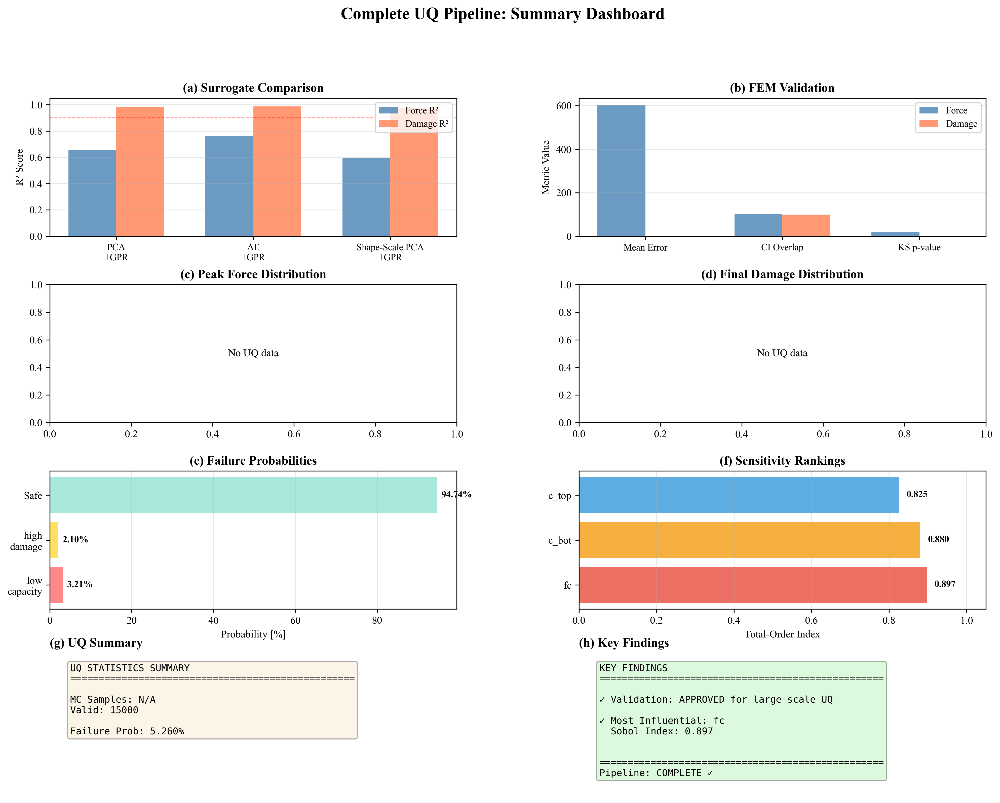
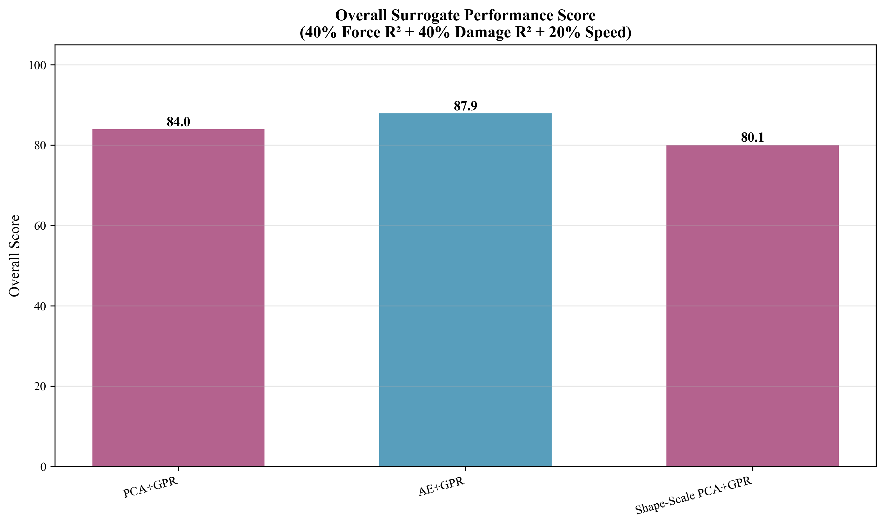
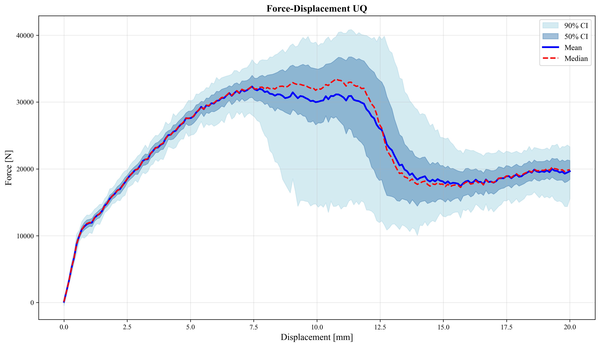
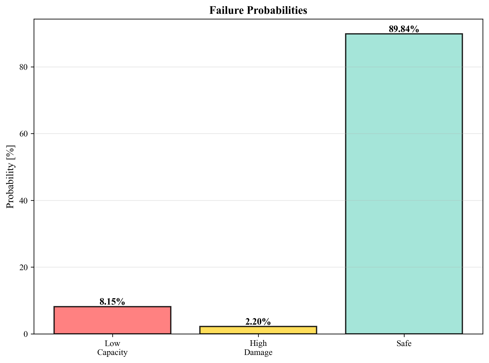
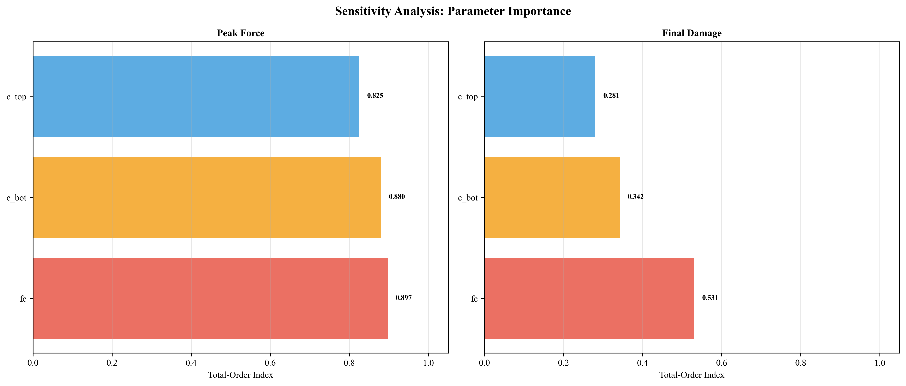
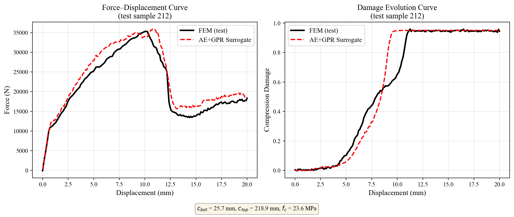

# Uncertainty Quantification for RC Beam FEM using Surrogates

End-to-end pipeline for uncertainty quantification (UQ) of a reinforced-concrete beam response, built on Abaqus FEM data and reduced-order surrogate models.

## What This Project Does
- Generates probabilistic input samples (LHS).
- Runs Abaqus simulations and extracts response curves.
- Builds surrogate models:
  - PCA + GPR
  - Autoencoder + GPR
  - Shape-Scale PCA + GPR
- Compares and validates surrogates against FEM.
- Performs large-scale UQ and sensitivity analysis.
- Produces publication-ready plots and summary outputs.

## Key Results (Current Run)
- Best-performing surrogate: **AE+GPR** (overall score: **87.90**).
- Surrogate accuracy (AE+GPR):
  - Force prediction `R^2`: **0.763**
  - Damage prediction `R^2`: **0.987**
- UQ on **15,000** evaluations:
  - Peak force mean: **36.32 kN** (P05-P95: **30.35-42.62 kN**)
  - Final damage mean: **0.9495** (P05-P95: **0.9414-0.9574**)
- Estimated failure probabilities:
  - Low capacity: **8.15%**
  - High damage: **2.20%**
  - Any failure: **10.16%**
- Sensitivity (Monte Carlo ranking, peak force): **`fc` > `c_bot` > `c_top`**.

## Results Gallery
Representative outputs are shown below; full details are available in the report and output folders.

| Pipeline Summary Dashboard | Surrogate Overall Score |
|---|---|
|  |  |

| UQ Envelope (Force) | Failure Probabilities |
|---|---|
|  |  |

| Sensitivity Rankings | Example FEM vs Surrogate Curve (Report Figure) |
|---|---|
|  |  |

## Report
- Full technical report: [`report/Report.pdf`](report/Report.pdf)
- Presentation slides: [`report/Presentation.pptx`](report/Presentation.pptx)

## Project Layout
- `01_samplying/`: input sampling and quality checks
- `02_abaqus/`: Abaqus job orchestration and extraction
- `03_postprocess/`: post-processing utilities
- `04_PCA/`: PCA-based surrogate workflow
- `05_autoencoder_gpr/`: AE + GPR workflow
- `06_shape_scale_gpr/`: shape-scale surrogate workflow
- `07_processing/`: comparison, validation, UQ, sensitivity, final outputs
- `augmentation_physics_fixed/`: augmented data assets

## Quick Start
1. Create a clean Python environment.
2. Install dependencies:

```bash
pip install -r requirements.txt
```

3. From repository root, run:

```bash
python 07_processing/run_uq_pipeline.py --mode all
```

## Abaqus Notes
- Abaqus-required scripts must be run with Abaqus Python where applicable.
- Set Abaqus command if needed:

```bash
# Windows PowerShell
$env:ABAQUS_CMD="C:\SIMULIA\Commands\abaqus.bat"
```

`02_abaqus/02_run_abaqus_jobs.py` uses `ABAQUS_CMD` from environment and defaults to `abaqus`.

## Reproducibility and Portability
- Hardcoded machine-specific absolute paths were removed.
- Core scripts now use repository-relative paths via `Path(__file__)`.
- Run scripts from the repository root for consistent behavior.

## Typical End-to-End Flow
1. `01_samplying/*`
2. `02_abaqus/*`
3. `03_postprocess/*`
4. `04_PCA/*`, `05_autoencoder_gpr/*`, `06_shape_scale_gpr/*`
5. `07_processing/run_uq_pipeline.py --mode all`

## Authors
- Olajide Badejo
- Sulaiman Abdul-Hafiz Akanmu
