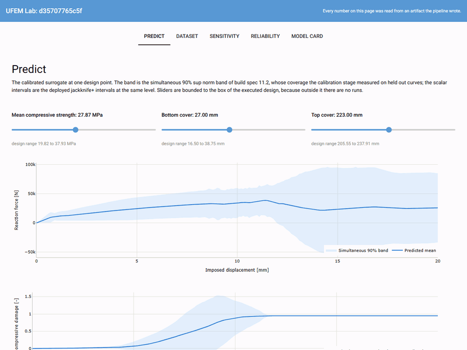

# UFEM 2.0: Calibrated Surrogate Modeling and UQ of a Softening RC Beam



*UFEM Lab (`ufem lab`): the calibrated surrogate morphing under a strength sweep, the 400
point design with its completion probability surface, one finite element run against the
surrogate's prediction at the same inputs, and a limit state threshold recounting the
propagated Monte Carlo sample. Every number on those panels was read from an artifact the
pipeline wrote. Recorded from the running dashboard by `scripts/capture_ui_gif.py`.*

This project builds a reproducible uncertainty quantification pipeline for a reinforced
concrete beam with material softening. From a completed campaign of Abaqus concrete damaged
plasticity simulations it constructs a functional surrogate of the whole load displacement
and damage evolution response, calibrates the predictive uncertainty against held out data
rather than asserting it, quantifies the global sensitivity of the response to the
independent input random variables three separate ways that have to agree, estimates failure
probabilities with stated error bars, and exposes the result through a local dashboard, a
compiled LaTeX report, and this repository, where every published number is regenerable from
a committed manifest whose hashes resolve to real files and a real commit.

The governing rule, and the reason the project was rebuilt rather than patched: no number
leaves here unless the pipeline can regenerate it from raw inputs, and no uncertainty is
reported unless it was propagated rather than manufactured.

<!-- BEGIN INJECTED RESULTS -->

Results are injected here from the artifact manifests at Phase P10. Nothing is claimed yet.

<!-- END INJECTED RESULTS -->

## Status

| Phase | What it delivers | State |
|---|---|---|
| P0 | Scaffold, config, manifests, runner, lint, CI | Complete |
| P1 | Ingest and common grid | Complete |
| P2 | Audit, censoring model, first compiled report | Complete |
| P3 | Registration and reduction | Complete |
| P4 | Gaussian process surrogate, baselines, validation | Complete at this commit: the surrogate beats all four baselines out of sample on the four headline scalar quantities of interest (peak load, displacement at peak, initial stiffness, absorbed energy); on the whole reconstructed curve the three non trivial baselines edge it out, and the table says so |
| P5 | Conformal calibration, scalar and functional | Complete at this commit: the calibration gate of build spec 11.5 passed, with simultaneous 90 percent functional bands and jackknife+ scalar intervals both at 0.9040 leave one out coverage (95 percent Wilson interval [0.855, 0.938], exact finite sample bracket [0.900, 0.905]); the measured out of fold variance scaling is within one percent of 1 for nine of eleven scalars and 1.793 for the load displacement curve |
| P6 | Sensitivity | Complete at this commit: the sparse chaos expansions were fitted and cross checked against Gaussian process posterior Sobol distributions, and the trust gate of build spec 12.1 withheld all 24 of them, so no Sobol index value and no input ranking is published from this campaign; the gate outcome, the explainable variance ceiling implied by the fitted nuggets and the model free design roughness are published in its place |
| P7 | Propagation and reliability | Complete at this commit: 100000 sample Monte Carlo through the calibrated surrogate with the aleatory and epistemic layers kept apart; the headline failure probability is 0.0479 that the peak load falls below its 33.2 kN characteristic value, binomial standard error 0.00068, against a surrogate aware conservative bound of 0.2654, with 46.6 percent of the Monte Carlo mass outside the validity domain and no probability below 1e-4 claimed |
| P8 | UFEM Lab dashboard | Complete at this commit: `ufem lab` serves the five panels of build spec 15 over the artifact store, with the server side slider to repaint work measured at 32.8 ms median over 100 seeded positions against the 50 ms budget and 59 ms slider to repaint in a headless browser; the UI package holds no computed constant, which is checked by parsing every module rather than by grepping it; the sensitivity panel draws no Sobol bar, because every index is withheld |
| P9 | Ablations and complete report | Complete at this commit: ablations 2 through 5 ran against the production pipeline in the P4 fold harness, every prediction committed before its measurement, and 7 of the 13 committed claims held. The verdict in one line: the shipped pipeline earns its place at the peak load, which is the quantity the reliability analysis thresholds, and loses on whole curve error to every direct curve model tried, so the reconstruction path is where it leaks. The sharpest single pair of numbers is the B-spline rival's peak load bias of -3035 N against the shipped pipeline's -285 N on the same folds. The report is structurally complete with its ablations, limitations and outlook sections |
| P10 | Final QA, README injection, release | Not started |

The full phase definitions and their gates are in `docs/BUILD_SPEC.md` section 22.

## Quick start

Requires CPython 3.14 on Windows or Linux.

```powershell
py -3.14 -m venv .venv
.venv\Scripts\python -m pip install --upgrade pip
.venv\Scripts\pip install -e .[dev]
.venv\Scripts\ufem doctor
.venv\Scripts\ufem run all
```

`ufem doctor` prints the resolved version matrix, the torch build and device, and the
SHA-256 of the configuration, then records that matrix in `docs/DESIGN_DECISIONS.md`. Run it
first; if it does not agree with what you expect, nothing downstream is worth reading.

`ufem run all` walks the stages in order. A stage whose cache key is unchanged prints
`[cache hit]` and is skipped; `--force` reruns it. Stages that a later phase will implement
raise with the phase named, so at this commit everything from `run ingest` through
`run propagate` does real work and `run all` then reports that `report` arrives in P9 and
exits nonzero. That is the intended behavior, not a failure of the install. The full Gaussian
process fit is a single threaded, under 60 second cost (`ufem run surrogate`); the grouped fold
validation harness (`ufem run validate`) recomputes the registration and every reduction basis
inside each of its 10 folds and costs several minutes, per the arithmetic in
`docs/DESIGN_DECISIONS.md`; `ufem run calibrate` costs about two minutes, almost all of it the
10 fold CV+ cross check, and it exits nonzero if the calibration gate fails; `ufem run
sensitivity` costs about three minutes, almost all of it the 200 posterior realizations per
target that the Sobol cross check needs; `ufem run propagate` costs about forty seconds for
the whole 100000 sample propagation, because the Monte Carlo through the Gaussian processes is
batched matrix algebra rather than one library call per draw.

The dashboard of build spec 15 reads the same artifact store and computes nothing of its own:

```powershell
.venv\Scripts\ufem lab
```

It loads the store before the server starts, so a pipeline that has not run produces a named
error on the command line rather than a dashboard of empty panels, and it then serves
`http://127.0.0.1:8080`. `--host`, `--port` and `--no-browser` are there for automation.

Two products of this phase are scripts rather than stages, and both read the artifact store:

```powershell
.venv\Scripts\python scripts\ablation_1_registration.py
.venv\Scripts\python report\figures_src\make_figures.py
```

Ingest and grid read the two raw campaign CSVs from `legacy_salvage/data/`. Those are 123 MB
and are deliberately not tracked by git; the ingest manifest records the SHA-256 of each at
its pinned location. If they are absent, the stage raises naming the file rather than
producing an empty result. The gridded outputs are committed under `data/processed/`, so the
repository still reads without them.

After the stages, two generators turn the artifacts into documents. Neither recomputes
anything; both read the artifact store and fail with a named diagnostic if a stage has not
run.

```powershell
.venv\Scripts\python scripts\make_data_card.py
.venv\Scripts\python scripts\make_model_card.py
.venv\Scripts\python report\figures_src\make_figures.py
cd report; latexmk -pdf -halt-on-error main.tex
```

The README GIF above is regenerated the same way, from the running dashboard rather than from
a mock of it. It needs a browser, which `pip install -e .[dev]` does not bring:

```powershell
.venv\Scripts\python -m playwright install chromium
.venv\Scripts\python scripts\capture_ui_gif.py
```

## Repository layout

```
UFEM_2.0/
  pyproject.toml            single source of pinned dependencies, dev extras, ufem entry point
  configs/
    probabilistic_model.yaml  THE distributions. Nothing else in the repo declares one.
    pipeline.yaml             grids, thresholds, kernel settings, MC size, limit states, paths
  src/ufem/
    config.py               Pydantic models, the feature contract, config hashing
    manifest.py             content addressed artifact store
    runner.py               ufem run <stage>|all and ufem doctor, pure batch
    ingest.py               raw CSVs to deduplicated, typed Parquet
    grid.py                 both signals on the common displacement grid, plus the scalar QoIs
    audit.py                validity reclassification, censoring statistics, completion model
    validity.py             the validity domain contract every downstream stage must consult
    register.py             landmarks, arc length, SRVF registration, warp tangent space
    reduce.py               functional PCA on amplitude, phase and damage
    surrogate.py            one Gaussian process per score and per scalar, and the reconstruction
    validate.py             the one fold honest harness, the four baselines, the gate
    calibrate.py            jackknife+ scalars, sup norm functional bands, the calibration gate
    conformal_functional.py the simultaneous band construction, about 100 lines of NumPy
    baselines.py            the four models the surrogate has to beat out of sample
    sensitivity.py          sparse chaos with the Q2 gate, posterior Sobol, functional indices
    propagate.py            the two Monte Carlo layers, the limit states, the conservative bound
    plotting/               every report figure, behind one style module
    ui/                     UFEM Lab: store, predict, figures, app, layout constants
  data/
    audit_reference/        committed golden values from the pre build audit, P1 and P2 gate on these
    processed/              the small pipeline outputs, committed for self containment
    quarantine/             what is deliberately not used, and why
  legacy_salvage/           read only inputs carried over from v1, never edited in place
  v1_legacy/                the frozen v1 pipeline, release v1.0.0, read only
  experiments/results/      artifact store, <stage>/<config hash>/manifest.json
  report/
    main.tex                the growing project report, no number typed into its prose
    tables/                 generated LaTeX fragments, committed, staleness gated by a test
    figures/                generated PDFs, committed so report.yml can build without Python
  tests/                    contract, property, golden, manufactured, integration
  scripts/                  dash_lint.py, check_file_sizes.py, make_data_card.py,
                            make_model_card.py, capture_ui_gif.py, ablation_1_registration.py
  docs/                     BUILD_SPEC, ARCHITECTURE, DESIGN_DECISIONS, ENGINEERING_LOG,
                            DEFECT_LOG, DATA_CARD, MODEL_CARD, media/ufem_lab.gif
  .github/workflows/        ci.yml, report.yml
```

`docs/ABLATIONS.md` records each ablation's predicted outcome, committed before the
measurement exists so the commit order is the evidence, followed by the result and a verdict.
The registration ablation of Phase P3 is the first: two of its three predictions held and one
was refuted, and the refutation is reported as such rather than quietly dropped.

`docs/DATA_CARD.md` is the campaign's data card: the design and its realized moments, the
198/202/0 extraction split, the censoring bias tables with their tests and effect sizes, the
completion model's cross validated performance, the validity domain, and the importance
weighting sensitivity. It is generated by `scripts/make_data_card.py` from the artifact store
and a test fails if the committed copy has drifted from what the pipeline produces now.

`docs/MODEL_CARD.md` is the surrogate's model card, generated the same way by
`scripts/make_model_card.py` and gated the same way: what the model predicts and from what,
the validity domain and the censored corner it excludes, the out of sample table, the
calibration gate with its measured coverage, the propagated reliability numbers with their
bounds and their floor, and a known failure modes section that names the design roughness,
the withheld sensitivity indices, the censoring, the damage saturation and the fixed model
parameters. UFEM Lab's model card panel is built from the same artifacts, so the document
and the dashboard cannot disagree.

## Versioning

- **v1.0.0** is the frozen v1 pipeline, preserved in `v1_legacy/`. Its published metrics are
  invalid, for the reasons set out in section 5 of `docs/BUILD_SPEC.md` and summarized in
  `v1_legacy/README.md`. It is kept as a record of the simulation campaign and as the
  forensic archive for the corrected campaign of Track B, not as a source of results.
- **v1.1.0** is the 2.0 overhaul, built from scratch on the same inherited data. The
  in progress version is `1.1.0.dev0`, declared in `pyproject.toml` and reported by
  `ufem doctor`.

## Contributing gates

A change lands only when the dash and banned identifier lint passes, no tracked file exceeds
5 MB, `ruff check src tests scripts` is clean, and the test suite passes. All four run in
CI on every push to `main` and to any `phase/**` branch, and on every pull request.

## License

MIT. See `LICENSE`.
