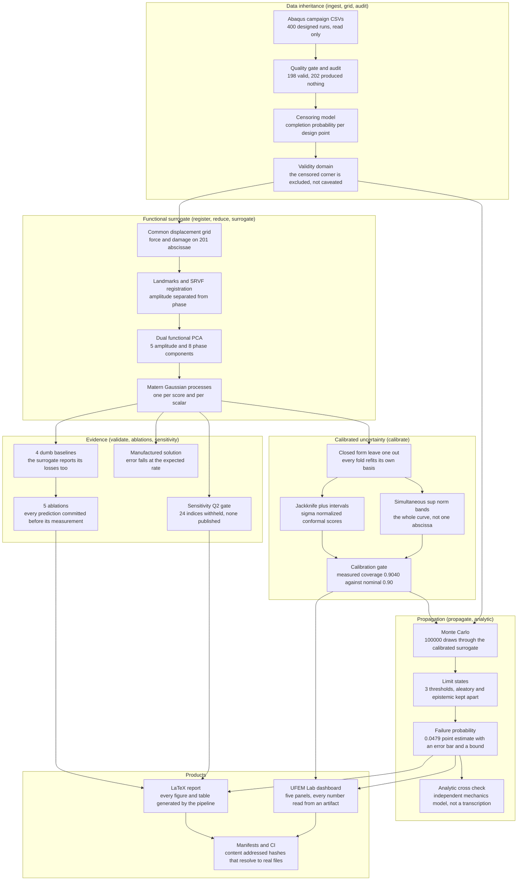
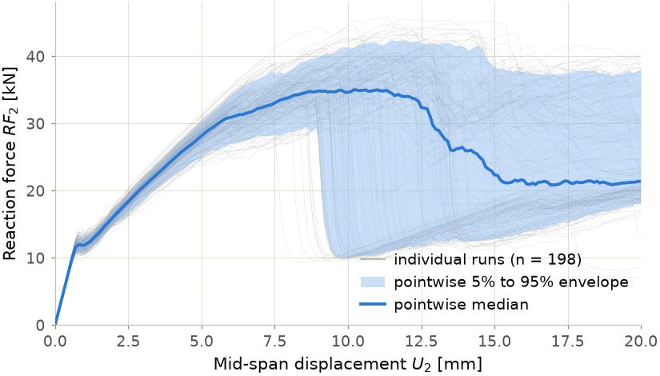
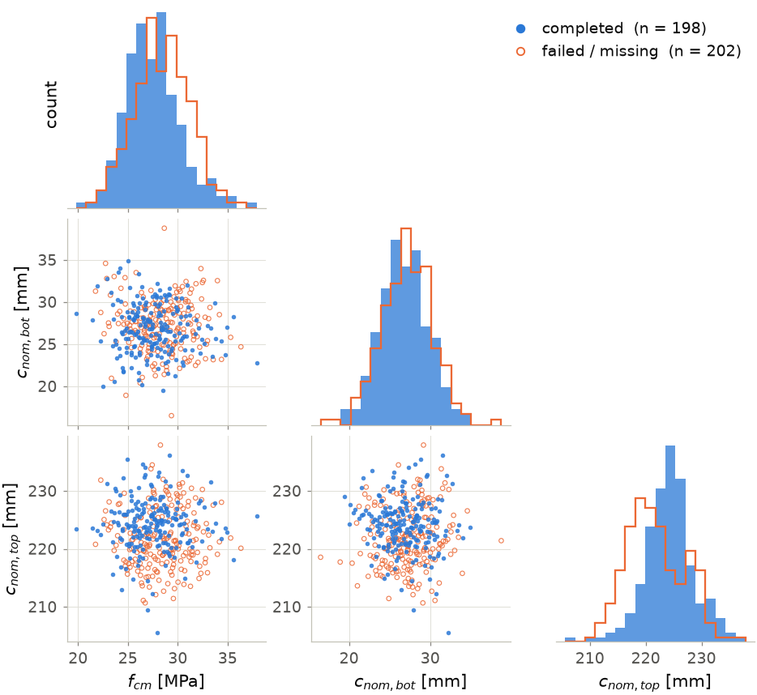
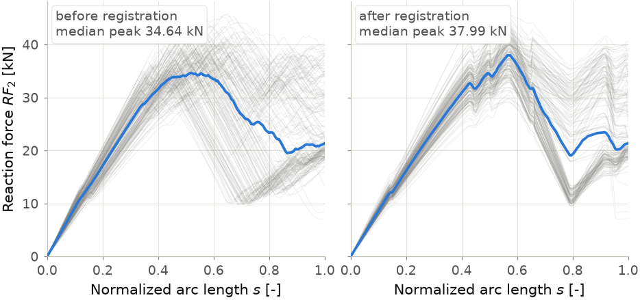
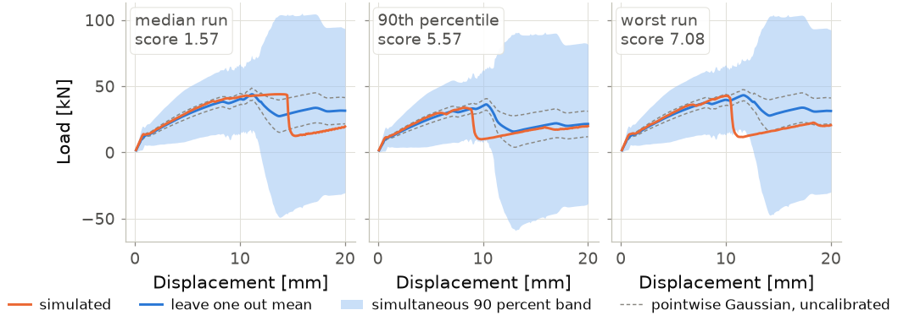
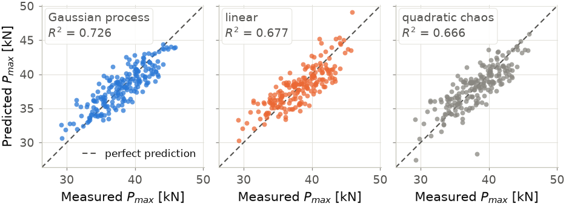
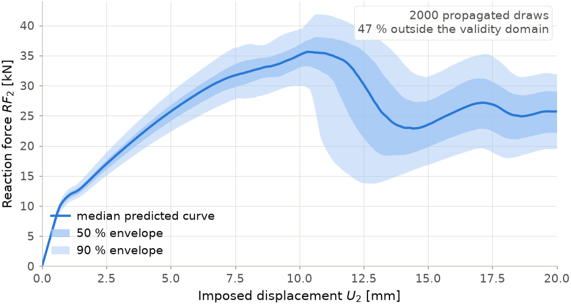

# UFEM 2.0

**A calibrated functional surrogate and uncertainty quantification pipeline for a softening
reinforced concrete beam, where every published number is regenerable from a committed
manifest or it does not get published.**


*[UFEM Lab](#ufem-lab-the-local-dashboard) (`ufem lab`), recorded from the running dashboard:
the calibrated prediction morphing under a strength sweep, the quantities of interest with
their conformal intervals, a query driven into the censored corner until the prediction grays
out and names the corner it fell into, one finite element run against the surrogate's
prediction at the same inputs, and a limit state threshold recounting the propagated Monte
Carlo sample. Every number on those
panels was read from an artifact the pipeline wrote.*

<!-- BEGIN INJECTED: toplinks -->

**[Read the report (PDF)](https://github.com/Olajide-Badejo/Uncertainty-Quantification-and-Surrogate-Modeling-in-FEM/releases/download/v1.1.0/ufem-2.0-report-v1.1.0.pdf)** &nbsp;·&nbsp; [See the dashboard](#ufem-lab-the-local-dashboard) &nbsp;·&nbsp; [Results at a glance](#results-at-a-glance) &nbsp;·&nbsp; [Quick start](#quick-start) &nbsp;·&nbsp; [Build specification](docs/BUILD_SPEC.md)

<!-- END INJECTED: toplinks -->

<!-- BEGIN INJECTED: badges -->

[](https://github.com/Olajide-Badejo/Uncertainty-Quantification-and-Surrogate-Modeling-in-FEM/actions/workflows/ci.yml)
[](https://github.com/Olajide-Badejo/Uncertainty-Quantification-and-Surrogate-Modeling-in-FEM/actions/workflows/report.yml)
[](https://github.com/Olajide-Badejo/Uncertainty-Quantification-and-Surrogate-Modeling-in-FEM/releases)
[](https://www.python.org/downloads/)
[](LICENSE)

<!-- END INJECTED: badges -->

## What this is

A finite element campaign tells you what a beam did under the loads you happened to simulate.
It does not tell you what the beam will do under the loads you did not, how confident you are
allowed to be about that, or which of your material assumptions the answer actually hangs on.
This repository is the machinery that turns the first into the other three, and then refuses
to publish any part of it that it cannot regenerate.

<!-- BEGIN INJECTED: scope -->

The evidence is a completed Abaqus concrete damaged plasticity campaign: 400 designed
simulations, of which 198 produced a usable response and 202 produced nothing at all. The
surrogate is fitted on those 198 runs, over 3 independent inputs, and it predicts the whole load
displacement and damage evolution curve rather than a summary of it. The failures are not spread
evenly across the design, so every product carries a machine checked validity domain that covers
58.0 percent of the design box and excludes the corner where the campaign died.

<!-- END INJECTED: scope -->

The governing rule, and the reason the project was rebuilt from scratch rather than patched:
**no number leaves here unless the pipeline can regenerate it from raw inputs, and no
uncertainty is reported unless it was propagated rather than manufactured.** The predecessor
failed that test in a way that is worth reading about before trusting anything in this class
of project; see [Versioning](#versioning).

## How it fits together

<!-- BEGIN INJECTED: schematic -->


```mermaid
flowchart TD
    subgraph inherit["Data inheritance (ingest, grid, audit)"]
        RAW["Abaqus campaign CSVs<br/>400 designed runs, read only"]
        QGATE["Quality gate and audit<br/>198 valid, 202 produced nothing"]
        CENS["Censoring model<br/>completion probability per design point"]
        DOM["Validity domain<br/>the censored corner is excluded, not caveated"]
    end
    subgraph surro["Functional surrogate (register, reduce, surrogate)"]
        GRIDN["Common displacement grid<br/>force and damage on 201 abscissae"]
        SRVF["Landmarks and SRVF registration<br/>amplitude separated from phase"]
        PCA["Dual functional PCA<br/>5 amplitude and 8 phase components"]
        GPS["Matern Gaussian processes<br/>one per score and per scalar"]
    end
    subgraph calib["Calibrated uncertainty (calibrate)"]
        LOO["Closed form leave one out<br/>every fold refits its own basis"]
        JKP["Jackknife plus intervals<br/>sigma normalized conformal scores"]
        BAND["Simultaneous sup norm bands<br/>the whole curve, not one abscissa"]
        CGATE["Calibration gate<br/>measured coverage 0.9040 against nominal 0.90"]
    end
    subgraph evid["Evidence (validate, ablations, sensitivity)"]
        BASE["4 dumb baselines<br/>the surrogate reports its losses too"]
        ABL["5 ablations<br/>every prediction committed before its measurement"]
        MANU["Manufactured solution<br/>error falls at the expected rate"]
        QTWO["Sensitivity Q2 gate<br/>24 indices withheld, none published"]
    end
    subgraph prop["Propagation (propagate, analytic)"]
        MC["Monte Carlo<br/>100000 draws through the calibrated surrogate"]
        LSTATE["Limit states<br/>3 thresholds, aleatory and epistemic kept apart"]
        PF["Failure probability<br/>0.0479 point estimate with an error bar and a bound"]
        XCHK["Analytic cross check<br/>independent mechanics model, not a transcription"]
    end
    subgraph prods["Products"]
        LAB["UFEM Lab dashboard<br/>five panels, every number read from an artifact"]
        REP["LaTeX report<br/>every figure and table generated by the pipeline"]
        MAN["Manifests and CI<br/>content addressed hashes that resolve to real files"]
    end
    RAW --> QGATE --> CENS --> DOM
    DOM --> GRIDN --> SRVF --> PCA --> GPS
    GPS --> LOO --> JKP --> CGATE
    LOO --> BAND --> CGATE
    GPS --> BASE --> ABL
    GPS --> MANU
    GPS --> QTWO
    CGATE --> MC --> LSTATE --> PF
    PF --> XCHK
    DOM --> MC
    CGATE --> LAB
    PF --> REP
    ABL --> REP
    QTWO --> REP
    PF --> LAB
    REP --> MAN
    LAB --> MAN
```

<!-- END INJECTED: schematic -->

Every box is a stage or a script, every stage writes a content addressed manifest, and every
manifest records the config hash, the input digests, the resolved package versions and the
commit. A stage whose inputs have not changed is a cache hit; a stage whose upstream artifact
changed underneath it is not, which is a defect this project already fixed once and tested
against.

## Results at a glance

<!-- BEGIN INJECTED: results -->

| Out of sample quantity | Surrogate | Best baseline | Verdict |
|---|---|---|---|
| Peak load, leave one out test R2 | 0.7261 | 0.6774 (linear) | beats every baseline |
| Displacement at peak, leave one out test R2 | 0.2812 | 0.1824 (linear) | beats every baseline |
| Initial stiffness, leave one out test R2 | 0.2967 | 0.2343 (linear) | beats every baseline |
| Absorbed energy, leave one out test R2 | 0.4447 | 0.4277 (linear) | beats every baseline |
| Whole force curve, median relative L2 | 23.09 percent | 22.47 percent (nearest neighbour) | loses to linear, nearest neighbour, quadratic chaos |

<!-- END INJECTED: results -->

<!-- BEGIN INJECTED: coverage -->

**Calibration.** The gate of build spec 11.5 passed on all 7 criteria. Across the 6 counted
ones, simultaneous sup norm bands on both curve families and jackknife plus intervals on every
headline scalar, every one of them measured the same coverage: 0.9040 against a nominal 0.90,
with a 95 percent Wilson interval of [0.8550, 0.9377] that contains the nominal level. The band
that achieves it is not free: its median half width on the force curves is 25.70 kN.

<!-- END INJECTED: coverage -->

<!-- BEGIN INJECTED: reliability -->

**Reliability.** A Monte Carlo of 100000 draws through the calibrated surrogate puts the
probability that the peak load falls below its 33.2 kN characteristic value at 0.0479, binomial
standard error 0.00068, against a surrogate aware conservative bound of 0.2654 obtained by
counting a failure whenever the calibrated interval crosses the threshold. 46.6 percent of the
sample fell outside the validity domain, and no probability below 0.0001 is claimed at 198
training runs.

<!-- END INJECTED: reliability -->

<!-- BEGIN INJECTED: evidence -->

**Evidence.** The design choices were measured rather than assumed: 5 ablations ran against the
production pipeline in the same fold harness, each one's prediction committed before its
measurement existed so that the commit order is the evidence, and 9 of the 16 committed claims
held. The sharpest single pair of numbers in them is the B-spline rival's peak load bias of
-3035 N against the shipped pipeline's -285 N on the same folds: the direct curve model
reconstructs better and predicts the peak far worse. Every prediction, result and verdict is in
`docs/ABLATIONS.md`.

<!-- END INJECTED: evidence -->

### What those numbers do not say

<!-- BEGIN INJECTED: caveats -->

- **No sensitivity index is published.** All 24 sparse chaos expansions failed their Q2 gate, so
  the ranking of the inputs this campaign can support is nothing, and that is reported instead
  of a plausible bar chart.
- **The reliability bounds are dominated by surrogate error.** The conservative bound is 5.5
  times the point estimate, which measures the width of the calibrated interval rather than the
  fragility of the beam.
- **The design is censored.** 202 of 400 runs produced nothing and the failures cluster, so the
  survivors are a biased subsample and every number here is conditional on the validity domain.
- **The whole curve is where the pipeline leaks.** The force curve is reconstructed at a lower
  median relative L2 by 3 of the baselines than by the registered and reduced surrogate, and the
  table above says which.

<!-- END INJECTED: caveats -->

Each of those is a result rather than a disclaimer. A pipeline that reports the ablation it
lost, the index it could not justify and the corner of the design it cannot speak about is
worth more than one that reports a ranking it cannot support.

## What it produces

| The campaign | Where it died |
|---|---|
|  |  |
| Every completed run on the common displacement grid, with the pointwise envelope and the median through it. Softening, not a peak. | The executed design across the three inputs, completed against failed. The failures cluster, and that cluster is the reason for the validity domain. |

| Registration | Calibration |
|---|---|
|  |  |
| The curve family before and against after registration, with the cross sectional mean through it. Unregistered, averaging flattens the peak that every run has; registered, the mean keeps it. | Held out runs against the simultaneous sup norm band, at the median, the ninetieth percentile and the worst case. Coverage over the whole curve at once, measured rather than asserted. |

| Prediction | Propagation |
|---|---|
|  |  |
| Predicted against actual peak load on left out runs, the surrogate beside the two baselines that come closest to it. This is the quantity the reliability analysis thresholds. | The propagated response: the median predicted curve inside its inner and outer envelopes, with the share of the sample that fell outside the validity domain stated on its face. |

All six are exported by `scripts/make_readme_media.py` from the same figure functions the
report compiles, so a figure here and the same figure in the PDF cannot disagree.

## UFEM Lab, the local dashboard

`ufem lab` serves the artifact store on `127.0.0.1` and computes nothing of its own. It is the
fastest way to find out whether any of this is useful to you, and it is what the recording at
the top of this page shows. Five panels:

- **Predict.** Three sliders over the executed design. The calibrated curve, its simultaneous
  band and every quantity of interest with its conformal interval repaint as you move them. A
  query that lands in the censored corner is grayed out and told which corner it fell into: the
  shape stays readable, and nothing about it says the number under the cursor is trustworthy.
- **Dataset.** The design as it was executed, completed against failed, with the fitted
  completion probability surface under it. Click a completed point and the finite element run
  is drawn against the surrogate's prediction at the same three inputs.
- **Sensitivity.** What the Q2 gate withheld, and why. It draws no Sobol bar, because there is
  no index this campaign supports.
- **Reliability.** The limit states with their failure probabilities, error bars and
  conservative bounds, and a threshold slider that recounts the persisted Monte Carlo rows.
- **Model card.** The provenance, the resolved stack, the validity domain and the known
  failure modes, built from the same artifacts as [`docs/MODEL_CARD.md`](docs/MODEL_CARD.md),
  so the document and the dashboard cannot disagree.

The dashboard holds no computed constant, which is checked by parsing every module rather than
by grepping it. See [Quick start](#quick-start) to run it, and
[`scripts/capture_ui_gif.py`](scripts/capture_ui_gif.py) for how the recording was made.

## The five binding laws

These are the specification compressed, and they are enforced by tests and linters rather than
by good intentions.

<!-- BEGIN INJECTED: laws -->

1. **No manufactured uncertainty.** Every predictive interval is the output of a stated, tested
   procedure, and every calibration claim is verified by a coverage measurement with a
   confidence band.
2. **One probabilistic model.** The input random variables are defined exactly once, in one
   validated config file, hashed into every artifact.
3. **Out of sample or it did not happen.** Every reported metric is cross validated or held out,
   with the reduction basis recomputed inside each fold.
4. **Censoring is data.** The runs that failed are modeled, and everything downstream carries
   the domain they define.
5. **Traceability.** No number appears in the README, the report or the dashboard unless a
   committed manifest can regenerate it.

<!-- END INJECTED: laws -->

## Quick start

```powershell
git clone https://github.com/Olajide-Badejo/Uncertainty-Quantification-and-Surrogate-Modeling-in-FEM.git
cd Uncertainty-Quantification-and-Surrogate-Modeling-in-FEM
py -3.14 -m venv .venv
.venv\Scripts\pip install -e .[dev]
.venv\Scripts\ufem doctor
.venv\Scripts\ufem run all
.venv\Scripts\ufem lab
.venv\Scripts\pytest tests -m "not slow"
```

`ufem doctor` prints the resolved version matrix, the torch build and device, and the SHA-256
of the configuration. Run it first: if it does not agree with what you expect, nothing
downstream is worth reading. `ufem run all` walks the stages in order and prints `[cache hit]`
for any stage whose inputs are unchanged; `--force` reruns one. `ufem lab` loads the artifact
store before the server starts, so a pipeline that has not run gives a named error rather than
a dashboard of empty panels.

<!-- BEGIN INJECTED: quickstart -->

A full regeneration from the raw campaign CSVs runs in under 20 minutes on the reference
machine, inside the 30 minute budget of build spec section 23. The per stage wall times are in
`docs/ENGINEERING_LOG.md`; they are deliberately not quoted here, because a document gated on
byte identity must not carry a quantity that moves without a measurement moving.

<!-- END INJECTED: quickstart -->

The two raw campaign CSVs live in `legacy_salvage/data/` and are too large for git; the ingest
manifest records the SHA-256 of each at its pinned location, and the gridded outputs are
committed under `data/processed/`, so the repository still reads without them. The documents
and figures are regenerated after the stages, and none of these recompute anything:

```powershell
.venv\Scripts\python scripts\make_data_card.py
.venv\Scripts\python scripts\make_model_card.py
.venv\Scripts\python scripts\readme_inject.py
.venv\Scripts\python report\figures_src\make_figures.py
.venv\Scripts\python scripts\make_readme_media.py
cd report; latexmk -pdf -halt-on-error main.tex
```

## Repository layout

```
UFEM_2.0/
  configs/
    probabilistic_model.yaml  THE distributions. Nothing else in the repo declares one.
    pipeline.yaml             grids, thresholds, kernel settings, limit states, paths
  src/ufem/
    config.py                 Pydantic models, the feature contract, config hashing
    manifest.py               content addressed artifact store
    runner.py                 ufem run <stage>|all and ufem doctor, pure batch
    ingest.py grid.py         raw CSVs to typed Parquet, then the common grid and the QoIs
    audit.py validity.py      validity reclassification, censoring, the domain contract
    register.py reduce.py     landmarks, SRVF registration, warps, dual functional PCA
    surrogate.py              one Gaussian process per score and per scalar
    validate.py baselines.py  the fold honest harness and the models it must beat
    calibrate.py              jackknife plus scalars, simultaneous sup norm bands, the gate
    sensitivity.py            sparse chaos with its Q2 gate, posterior Sobol, functional
    propagate.py analytic.py  the Monte Carlo layers, the limit states, the cross check
    plotting/ ui/             every figure behind one style module; UFEM Lab
  data/                       audit reference values, processed outputs, quarantine
  legacy_salvage/             read only inputs carried over from the predecessor
  v1_legacy/                  the frozen predecessor pipeline, read only
  experiments/results/        the artifact store, <stage>/<config hash>/manifest.json
  report/                     main.tex, generated tables/, generated figures/, figures_src/
  scripts/                    lints, card and README generators, ablations, release
  tests/                      contract, property, golden, manufactured, integration
  docs/                       the documentation set and docs/media/
  .github/workflows/          ci.yml, report.yml
```

## Documents

| Document | What it is for |
|---|---|
| [`docs/DATA_CARD.md`](docs/DATA_CARD.md) | The campaign: design, extraction split, censoring bias tables, completion model, validity domain. Generated. |
| [`docs/MODEL_CARD.md`](docs/MODEL_CARD.md) | The surrogate: scope, validity domain, out of sample table, calibration status, known failure modes. Generated. |
| [`docs/ARCHITECTURE.md`](docs/ARCHITECTURE.md) | The pipeline stage by stage and the artifact contract each one writes against. |
| [`docs/ABLATIONS.md`](docs/ABLATIONS.md) | Each ablation's predicted outcome, committed before the measurement existed, then the result and the verdict. |
| [`docs/DEFECT_LOG.md`](docs/DEFECT_LOG.md) | Every bug this project shipped and caught, with the regression test that now covers it. |
| [`docs/DESIGN_DECISIONS.md`](docs/DESIGN_DECISIONS.md) | Dated decisions, the resolved version matrix, and every deliberate deviation from the specification. |
| [`docs/ENGINEERING_LOG.md`](docs/ENGINEERING_LOG.md) | What actually happened, phase by phase, with the measurements. The project was built in gated phases and this is the record. |
| [`docs/BUILD_SPEC.md`](docs/BUILD_SPEC.md) | The specification the whole thing was built against, including the autopsy of the predecessor. |
| [`docs/RELEASE_CHECKLIST.md`](docs/RELEASE_CHECKLIST.md) | The definition of done, item by item, with the evidence for each. |
| [`CONTRIBUTING.md`](CONTRIBUTING.md) | Every gate a change must pass, and the generator that owns each published document. |
| [`data/quarantine/README.md`](data/quarantine/README.md) | What was deliberately not used, and why it is unusable as evidence. |
| [`data/audit_reference/README.md`](data/audit_reference/README.md) | The golden values from the pre build audit that the ingest and audit stages are gated against. |
| [`data/processed/README.md`](data/processed/README.md) | The committed pipeline outputs, so the repository reads without the raw campaign CSVs. |
| [`v1_legacy/README.md`](v1_legacy/README.md) | The frozen predecessor tree, and the notice that its numbers are invalid. |
| [`LICENSE`](LICENSE) | MIT. |

### Off the repository

<!-- BEGIN INJECTED: projectlinks -->

| Where | What is there |
|---|---|
| [Report PDF, v1.1.0](https://github.com/Olajide-Badejo/Uncertainty-Quantification-and-Surrogate-Modeling-in-FEM/releases/download/v1.1.0/ufem-2.0-report-v1.1.0.pdf) | The compiled report, attached to the release. Direct download. |
| [Release v1.1.0](https://github.com/Olajide-Badejo/Uncertainty-Quantification-and-Surrogate-Modeling-in-FEM/releases/tag/v1.1.0) | This overhaul, with its notes and its assets. |
| [Release v1.0.0](https://github.com/Olajide-Badejo/Uncertainty-Quantification-and-Surrogate-Modeling-in-FEM/releases/tag/v1.0.0) | The frozen predecessor. Its published metrics are invalid; see Versioning below. |
| [All releases](https://github.com/Olajide-Badejo/Uncertainty-Quantification-and-Surrogate-Modeling-in-FEM/releases) | Every tag, newest first. |
| [CI runs](https://github.com/Olajide-Badejo/Uncertainty-Quantification-and-Surrogate-Modeling-in-FEM/actions/workflows/ci.yml) | Lint, fast tests on two operating systems, and the full editable install job. |
| [Report build runs](https://github.com/Olajide-Badejo/Uncertainty-Quantification-and-Surrogate-Modeling-in-FEM/actions/workflows/report.yml) | The LaTeX build on a TeX Live container, with the PDF as a run artifact. |
| [Issues](https://github.com/Olajide-Badejo/Uncertainty-Quantification-and-Surrogate-Modeling-in-FEM/issues) | Defect reports, in the shape of `docs/DEFECT_LOG.md`: evidence first. |

<!-- END INJECTED: projectlinks -->

## Versioning

<!-- BEGIN INJECTED: versioning -->

- **v1.0.0**, the frozen predecessor, preserved read only in `v1_legacy/`. **Its published
  metrics are invalid**, and the evidence is section 5 of `docs/BUILD_SPEC.md`: the reported
  uncertainty was manufactured by an amplification factor and a standard deviation floor, and
  its own diagnostic output proved it. Nothing from it is repeated as a result here.
- **v1.1.0**, this overhaul, built from scratch on the same inherited campaign behind the gates
  above. The in progress version is `1.1.0.dev0`, declared in `pyproject.toml` and reported by
  `ufem doctor`.

<!-- END INJECTED: versioning -->

## What this is not

It is not a validated design tool. The beam geometry is fixed across the whole inherited
campaign, so nothing here transfers to another member. The dilation angle, the eccentricity,
the viscosity and the fracture energy were frozen across every simulation, so this pipeline
quantifies none of their contribution, and that is the largest single gap in its coverage of
its own uncertainty. The compressive damage scalar saturates at the material table cap in
every run, so the damage limit state asks when saturation arrives rather than whether it does,
and it should be read as a screening number. Nothing here is a statement about the censored
corner of the design, and the dashboard grays out any query that lands in it.

Closing those gaps needs new solver runs, not better statistics. That is Track B of
`docs/BUILD_SPEC.md`: a corrected Abaqus campaign with fracture energy coupled to strength, a
mesh convergence study, the failed runs rerun, and the model parameters promoted to inputs.
It is gated on solver access and none of it is claimed here.

## Contributing

<!-- BEGIN INJECTED: gates -->

A change lands only when the dash and banned identifier lint passes, no tracked file exceeds 5
MB, `ruff check src tests scripts` is clean, and the suite of 564 test functions across 31
modules passes. Those are declarations rather than the cases pytest expands them into. All four
gates run in CI on every push to `main` and to any `phase/**` branch, and on every pull request.

<!-- END INJECTED: gates -->

The one rule that is easy to break by accident: numbers in `README.md`, in the report and in
the dashboard are injected from artifacts, never typed. If you need to state a measurement,
add it to the generator that owns that document. [`CONTRIBUTING.md`](CONTRIBUTING.md) lists
every gate, every generator and every staleness test that pairs with one.

## License

MIT. See [`LICENSE`](LICENSE).
