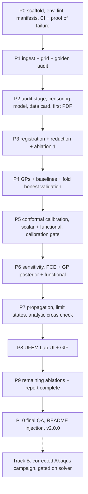

# UFEM 2.0: Calibrated Surrogate Modeling and Uncertainty Quantification of a Softening RC Beam. Build Specification v2

## 0. How to use this document

Paste this entire file as the opening message of a fresh Claude Code session on the target machine (Section 3). **This is a from scratch build specification.** The existing `Scripts_2_0` tree is not refactored, extended, or trusted: it is a read only quarry from which a short list of named assets (Section 6.4) is extracted, and everything else is left behind. The new repository is created empty at `UFEM_2.0/` and every file in it is written new, in order, on branches, behind machine checkable gates.

This document folds in three completed investigations, run in August 2026 on the actual machine and the actual data: a full structural audit of the `Scripts_2_0` codebase, a row by row audit of the 400 sample simulation campaign, and a literature and toolchain survey verified against the live package indices and the installed interpreter. The defects those investigations found are not appended as a fixes phase. They are designed out from the first commit, because almost every defect was the faithful execution of a scope that was never written down. This document is the corrected scope.

Work the phases in Section 22 strictly in order. Do not start a phase until the previous phase's gate passes with output shown. Propose a short plan for Phase P0 before writing code, then proceed phase by phase. If genuinely blocked, ask one specific question rather than drifting from the spec.

### 0.1 The prime directive

> **No number leaves this project unless the pipeline can regenerate it from raw inputs, and no uncertainty is reported unless it was propagated, not manufactured.**

The predecessor project's headline reliability numbers came from a script that injected artificial variance (an amplification factor, a noise floor on the predictive standard deviation, a damage scale drawn at random per sample) and then reported the spread as uncertainty. Its own diagnostic output proved the fabrication: the predicted peak force correlated with concrete strength at r = -0.006 while the source FEM data correlates at r = 0.80. That failure mode, plausible numbers with no chain of custody, is the single thing this specification exists to make impossible.

### 0.2 The five binding laws

These five sentences are the whole specification compressed. Everything else is detail.

1. **No manufactured uncertainty.** Every predictive interval is the output of a stated, tested procedure (GP posterior, conformal calibration, bootstrap), and every calibration claim is verified by a coverage measurement with a binomial confidence band. Variance amplification factors, noise injections, and standard deviation floors are forbidden in production code paths.
2. **One probabilistic model.** The input random variables, their distributions, parameters, bounds, and couplings are defined exactly once, in one validated config file, hashed into every artifact. A stage that re declares a distribution is a build error.
3. **Out of sample or it did not happen.** Every reported metric is cross validated or held out, with the reduction basis recomputed inside each fold. A train metric may appear only next to its test counterpart. A surrogate that does not beat the stated dumb baselines is reported as failing, not tuned until the test set is memorized.
4. **Censoring is data.** 202 of 400 simulations produced nothing, and the failures cluster in a known corner of the input space. The surviving 198 are a biased subsample. Every downstream product (surrogate, sensitivity index, failure probability, UI prediction) either models that censoring or carries a machine checked validity domain that excludes the censored corner.
5. **Traceability.** No number appears in the README, the report, or the UI unless it is reproducible from a committed manifest whose hashes resolve to real files and a real commit. Hand typed numbers are forbidden.

### 0.3 Pinned assumptions (change deliberately, not accidentally)

- **Version policy: pin the newest stable release of every tool, resolved at Phase P0, never a version copied out of this document.** Every version below was verified against the live index or the installed interpreter on 2026-08-28 and is the starting point for that resolution, not a pin in itself. Record the resolved matrix in `docs/DESIGN_DECISIONS.md` with its date, and again in every result manifest.
- Python: the venv already runs **CPython 3.14.0** and the whole required stack resolves on it (verified by dry run resolution on this machine). Stay on 3.14, GIL build. Free threading (3.14t) is explicitly rejected: untested across numba, fdasrsf, and scikit-fda, and useless at n = 198.
- **PyTorch from the cu130 index, never from PyPI.** The installed `torch 2.10.0+cpu` cannot see the GPU at all, and the cu126 wheels do not contain sm_120 code for the RTX 5070. The verified install is `pip install torch==2.13.0 --index-url https://download.pytorch.org/whl/cu130` (cu132 also valid), installed before anything else so the resolver cannot substitute the CPU wheel. Details and the three traps in Section 3.2.
- Core stack, newest stable as of 2026-08-28, all verified resolvable on this interpreter: numpy 2.5.x (or the installed 2.4.1), scipy 1.18.x, pandas pinned deliberately (3.0.x is out; pin and record), scikit-learn 1.9.0, GPyTorch 1.15.2, BoTorch 0.18.1, OpenTURNS 1.27.post1 (ships a `cp39-abi3` stable ABI wheel, so it works on 3.14 even though no cp314 tag exists; do not misdiagnose this), SALib 1.5.2, chaospy 4.3.21, fdasrsf 2.6.10 (cp314 wheel exists), hypothesis, pytest, pytest-regressions.
- **UQpy is banned as a dependency.** Verified on this machine: UQpy 4.2.1 hard pins `numpy==1.26.4` and fails to install on Python 3.14; pip silently backs off to 4.1.6, which still hard pins `beartype==0.18.5`. Everything it would have provided (AK-MCS, PCE) is either hand written (about 80 lines over a GPyTorch GP) or taken from OpenTURNS.
- Config: **YAML validated by Pydantic v2**, not Hydra. One pipeline, one fixed design, no multirun launchers; the SHA-256 of the validated, fully resolved config is the run identity. Hydra survives (1.3.5, 2026-08-05, now under hydra-ecosystem) but buys nothing here, and its OmegaConf dependency has an open maintenance question.
- Tracking: **plain content addressed manifests**, about 80 lines of code, not DVC (acquired by lakeFS in Nov 2025, do not bet the pipeline on it) and not MLflow/wandb.
- Report engine: **MiKTeX, already installed** (`pdflatex` and `latexmk` verified on PATH). `latexmk -pdf` is the build command. No tectonic on this machine.
- FEM solver: Abaqus (the Learning Edition that produced the existing campaign). **Track A of this build requires no Abaqus at all**; Track B (Section 14) requires it and is gated on its availability.
- License: MIT, recorded in `docs/DESIGN_DECISIONS.md`.

### 0.4 Explicitly out of scope

Do not do these unless a phase names them:

- **Neural operators (DeepONet, FNO).** This is a parametric problem, 3 scalars to one curve, not an operator learning problem, and the 2026 head to head evidence (Section 10.6) puts their data requirement at thousands of runs. Excluded with citations, not silently.
- **Deep kernel learning.** Documented failure mode at this sample size: overfits while looking low complexity to the marginal likelihood.
- **Multi fidelity kriging.** At 25 to 50 samples per input dimension the budget is 2.5 to 5 times the classical sufficiency rule; MF exists to rescue budgets below it. A one afternoon negative result is permitted in Track B, nothing more.
- **The 570 row augmented dataset.** Its generator script is absent from the repository, its job IDs collide with the real FEM job IDs, and it has no synthetic flag or parent lineage. It is unusable as evidence and is quarantined, not imported.
- **Retraining on Python 3.14t, distributed training, cloud anything.** The whole surrogate fits in seconds on one CPU core.
- Editing anything inside `Scripts_2_0/`, `Scripts/`, `results/`, or `PLOTS/`. Read only, forever.

---

## 1. Aim and objectives

**Aim.** Build from scratch a defensible, reproducible uncertainty quantification pipeline for a reinforced concrete beam with material softening: from the existing 198 valid Abaqus concrete damaged plasticity simulations, construct a functional surrogate of the full load displacement and damage evolution curves with calibrated predictive uncertainty, quantify global sensitivity of the response to the three independent input random variables, estimate failure probabilities with honest error bars, and expose the whole thing through an interactive local UI, a compiled LaTeX report, and a GitHub repository whose every number is regenerable from committed manifests.

**Objectives.**

1. Establish a single source of truth probabilistic model: Fcm lognormal(mean 28 MPa, CoV 0.10), bottom cover N(27, 3) mm, top cover N(223, 5) mm, and E as the deterministic Eurocode 2 function of Fcm that the data audit proved it already is (Spearman rho = 1.000, max relative deviation 2e-15). Three independent inputs, not four collinear ones.
2. Ingest the existing campaign through a quality gate that classifies all 400 samples (198 valid, 202 missing, zero partial, verified), documents the censoring bias (failures are enriched at low top cover, p = 2.9e-11, and high Fcm, p = 0.006), and fits a completion probability model so every downstream product knows where the data can be trusted.
3. Build the curve surrogate the literature actually supports at n = 198: landmark extraction, arc length reparameterization and elastic (SRVF) registration of the softening curves, functional PCA on the registered amplitude and phase, and independent Matern 5/2 ARD Gaussian processes on the scores, with scalar GPs on the engineering QoIs (peak load, displacement at peak, initial stiffness, absorbed energy, residual load, damage at fixed displacement).
4. Calibrate the uncertainty: closed form leave one out jackknife+ conformal prediction with sigma normalized scores on every scalar output, and sup norm functional conformal bands (modulation function equal to the GP posterior standard deviation) for simultaneous coverage over the whole curve. Report coverage with Wilson intervals, PIT heatmaps along the curve, CRPS against a climatology baseline, and predictive variance adequacy, before and after calibration.
5. Beat the mandatory baselines out of sample (linear model, quadratic polynomial chaos, k nearest neighbor curves, training mean curve) or report failure. Run the named ablations (unregistered PCA, autoencoder, deep ensemble, B-spline basis) so the design choices are measured, not asserted.
6. Quantify sensitivity three ways that must agree: analytic Sobol indices from a sparse LARS polynomial chaos expansion with corrected leave one out validation, Sobol distributions from GP posterior realizations, and pointwise in displacement plus eigenvalue aggregated functional indices.
7. Propagate the input distributions through the calibrated surrogate with at least 10^5 Monte Carlo samples, report failure probabilities for stated limit states with surrogate aware confidence bounds, and validate against the small analytic propagation baseline preserved from v1.
8. Ship UFEM Lab, a local web dashboard: sliders to curve with calibrated bands in under 50 ms, dataset and censoring explorer, sensitivity and reliability views, and a model card; plus a scripted GIF capture of it for the README.
9. Ship at professional standard: full test pyramid including property based and manufactured solution tests, CI proven capable of failing, a compiled LaTeX results report whose every figure and number is generated by the pipeline, and a public ready GitHub repository.

---

## 2. Estimated effort

**ESTIMATED RUNTIME OF THE FULL TRACK A PIPELINE, RAW CSV TO COMPILED REPORT: UNDER 30 MINUTES ON THE 14700K, MEASURED AND ENFORCED AS A GATE.** The GP fits are seconds; the expensive steps are the SRVF registration (minutes) and the PCE bootstrap.

**ESTIMATED BUILD EFFORT: 18 TO 26 WORKING SESSIONS FOR PHASES P0 THROUGH P10 (TRACK A COMPLETE). TRACK B, THE CORRECTED ABAQUS CAMPAIGN, ADDS 8 TO 14 AND IS GATED ON SOLVER ACCESS.**

These totals are higher than a naive feature count because they buy the Phase P2 data gate, the fold honest cross validation harness, the manufactured solution test, and the proof of failure CI gate. That work is what makes the rest safe to do at all. If effort is constrained, cut ablations from Section 10.6 and the Track B campaign, never the testing or calibration requirements.

**Stop points.** After P4 the project has an honest surrogate with measured out of sample error. After P6 its uncertainty is calibrated and its sensitivity story is cross checked. After P8 the UI runs. After P10 every claim in the README is true and `v2.0.0` is tagged. Each is a legitimate place to stop and ship.

Estimates, not measurements. Replace them with measured wall clock in `docs/ENGINEERING_LOG.md` as they become real.

---

## 3. Target machine and environment

| Component | Spec |
|---|---|
| CPU | Intel Core i7-14700K, 8 P plus 12 E cores, 28 threads |
| RAM | 32 GB installed, about 16 GB free alongside other projects. Treat 12 GB as the working ceiling. |
| GPU | RTX 5070, 12 GB, compute capability 12.0 (sm_120), driver 610.62, CUDA UMD 13.3. Narrowly scoped: used only for the neural ablations of Section 10.6. The production surrogate trains on CPU, deliberately (Section 17.2). |
| OS | Windows 11 Pro 10.0.26200, native (no WSL requirement anywhere in Track A) |
| Python | CPython 3.14.0 in the existing venv; create a fresh venv for the new repo at P0 |
| LaTeX | MiKTeX, `pdflatex` and `latexmk` verified on PATH |
| FEM | Abaqus Learning Edition (Track B only) |

### 3.1 The GPU trap, verified on this machine

Three traps, all confirmed by direct inspection of the live wheel indices and the installed interpreter on 2026-08-28:

1. **`pip install torch` from PyPI on Windows installs a CPU only build.** The venv currently holds literally `torch 2.10.0+cpu` with `torch.version.cuda = None`. The RTX 5070 is completely unused today.
2. **The cu126 wheels cannot run on this GPU.** Their architecture list stops at sm_90 with no PTX fallback, and they exist for every torch version, which is exactly what makes them the easy mistake.
3. **cu128 is a dead end on Windows**, dropped from the build matrix at torch 2.12.

The verified correct command, run before any other package so the resolver cannot substitute the CPU wheel:

```powershell
pip install torch==2.13.0 --index-url https://download.pytorch.org/whl/cu130
```

`torch-2.13.0+cu130-cp314-cp314-win_amd64.whl` was confirmed to exist on the index. cu132 is equally valid. At P0, re resolve the newest stable and record it.

### 3.2 Environment creation (Phase P0)

```powershell
py -3.14 -m venv .venv
.venv\Scripts\python -m pip install --upgrade pip
.venv\Scripts\pip install torch==<resolved> --index-url https://download.pytorch.org/whl/cu130
.venv\Scripts\pip install -e .[dev]    # everything else from PyPI, pinned in pyproject.toml
```

Gate: `python -c "import torch; assert torch.cuda.is_available()"` passes, and `nvidia-smi` shows the process during the smoke test; then `python -m ufem.doctor` (written at P0) prints the resolved version matrix and writes it to `docs/DESIGN_DECISIONS.md`.

### 3.3 The repository is not a venv

The predecessor's defining structural defect: pipeline code, `python.exe`, twelve console script executables, and 405 MB of solver scratch shared one git tracked directory, with 20 lines of `.gitignore` fighting the venv. The new rule is absolute: **the repository contains no interpreter, no venv, no solver scratch, and no file over 5 MB** (enforced by a pre commit hook). The venv lives in `.venv/`, ignored. Large inherited data is referenced by manifest hash at a pinned absolute location (Section 6.4), never copied into git.

---

## 4. Ground rules

1. **Never fabricate** a metric, coverage number, citation, URL, version, or API detail. Unverifiable means unstated.
2. **Never mark a phase complete without running its tests and showing output.**
3. **No em dashes, no en dashes anywhere** (U+2014, U+2013): code, comments, commits, markdown, LaTeX. No `--` or `---` in `.tex` prose, because of TeX ligatures. Enforced by `scripts/dash_lint.py`, wired into pre commit and CI from Phase P0.
4. **Predictive uncertainty is computed, never styled.** Any multiplicative factor, additive noise, floor, or clip applied to a variance in a production path is a build error; the words `AMPLIFY`, `noise_level`, and hard coded sigma floors are lint banned identifiers, a direct memorial to the defect of Section 5.1.
5. **Write as the repo owner.** First person, varied sentence length, concrete numbers over vague qualifiers, report prose in paragraphs not bullet walls, no AI stock phrasing.
6. Conventional Commits, one logical change each. No TODOs in shipped code, no dead code left behind, and never a commented out copy of an old version above the live one (the predecessor shipped a 1349 line file whose first 699 lines were the previous version commented out line by line).
7. **Every bug fixed gets a regression test that fails before the fix and passes after**, with both runs shown in the phase report.
8. **Silent fallbacks are forbidden.** A missing input file, a missing split file, an empty result set, or an unloadable model raises with a named diagnostic. The predecessor validated itself on training data because a missing `test_jobs.txt` silently fell back to all jobs; that class of bug ends here. Bare `except:` is lint banned.
9. **Work on branches**, one per phase, named `phase/pN-short-name`, merged only when the gate passes. Never commit directly to `main`.
10. **Update documentation in the same commit as the code.** Folder READMEs are generated or tested where they state numbers; a README claim that disagrees with the manifest is a CI failure (the predecessor's READMEs claimed test R2 0.95 where the artifact said 0.083).
11. **Maintain `docs/ENGINEERING_LOG.md` and `docs/DEFECT_LOG.md` continuously**, dated entries, never deleted. The report's discussion section is built from them.
12. **Predict before you measure.** Every ablation and every cross validation experiment gets its predicted direction committed before the first number is recorded. The commit order is the evidence.
13. **Determinism.** Every stochastic step takes its RNG from a `SeedSequence` spawned tree whose entropy is logged in the manifest. `np.random.seed` and bare `np.random.*` calls are lint banned. Integer `random_state` for scikit-learn, never a RandomState instance.
14. **Units are typed.** Force in newtons, displacement in millimeters, stress in MPa, at every module boundary, stated in docstrings and checked by contract tests. Plots and the UI display kN.

---

## 5. The autopsy: what the audit found, and the rule that prevents each recurrence

This section exists so the new build never repeats an old mistake by accident. Each finding is stated with its evidence and the specific rule or gate that kills it. All findings were verified directly on the tree at `Scripts_2_0/` in August 2026.

### 5.1 Fabricated uncertainty (severity: fatal)

`07_processing/uncertainty_quantification_07.py` floors the GP standard deviation at 0.01, multiplies variance by an `AMPLIFY_VARIANCE` factor of 1.1, injects 0.5 percent multiplicative noise on the force, and draws the damage magnitude from a random training sample independently of the inputs. A `param_scale` that would have coupled the prediction to the inputs is computed and then hard coded to 1.0. The script's own output proves the consequence: predicted peak force correlates with fc at r = -0.006 against 0.80 in the source data. Every headline number in the predecessor's README, FINAL_REPORT, and PDF descends from this. The sensitivity stage used a third, different distribution set with amplification 1.5 and noise 0.02, and its Sobol output shows the signature of a noise dominated surface: first order indices summing to 0.23 with total indices near 0.88 for three independent inputs.

**Killed by:** binding law 1, ground rule 4 (lint banned identifiers), and the calibration gate of Section 11.5, which requires measured coverage with confidence bands on real held out data before any propagated number is reported.

### 5.2 All three surrogates fail out of sample, and the docs quote different numbers (severity: fatal)

Measured from the predecessor's own artifacts: PCA+GPR force score test R2 mean 0.083; AE+GPR force test R2 -0.007 in latent space and 0.366 at curve level against a train RMSE of 4e-7 (textbook memorization); shape scale GPR train R2 0.99999999 with all three test heads at R2 <= 0, collapsing to a near constant mean curve (predicted peak force std 998 N against 3141 N real). The comparison stage then re evaluated on 50 random test jobs with a different metric and published force R2 0.655 to 0.763, which is what the README quotes.

Root causes are all identifiable: kernel noise floors near zero with length scale bounds down to 1e-2 (interpolation of noise), fc and E fed as two features despite exact collinearity, three stages using three different feature sets and orders, and augmented children split across train and test with no group awareness.

**Killed by:** binding law 3, the baseline gate of Section 10.5, the single feature contract of Section 9.2, fold honest cross validation of Section 16.3, and the ban on the augmented dataset.

### 5.3 The input distributions are declared three times, differently (severity: severe)

Sampling used lognormal Fcm(28, CoV 0.10), N(27, 3), N(223, 5). The UQ stage silently used normal Fcm(30, 2.8), N(25, 3), N(215, 5). The sensitivity stage used uniform bounds. **Killed by:** binding law 2, the single Pydantic validated `probabilistic_model.yaml` of Section 9.1, and a CI test asserting no other module literal declares a distribution parameter.

### 5.4 E and Fcm are the same random variable (severity: severe)

The audit fit `E = 11026.119 * Fcm^0.300` across all 400 design rows with maximum relative error 2e-15: E is the Eurocode 2 expression `22000 * (fcm/10)^0.3` evaluated exactly. Spearman rho = 1.000. Feeding both to any regressor makes ARD length scales and sensitivity indices unidentifiable; Saltelli estimators that resample columns independently are structurally invalid under dependence and will return confidently wrong numbers. **Killed by:** the input contract of Section 9.2: the surrogate feature vector is `(Fcm, c_bottom, c_top)`, E is derived, and Track B promotes the strength stiffness model error to an explicit fourth independent input.

### 5.5 The campaign is censored, and the survivors are biased (severity: severe)

400 designed samples, 198 present in the extracted data, 202 absent entirely, zero partial (every present run reached t = 1.0 with softening captured; the failure mode is binary). Failures cluster: low top cover fails at 76 percent in its lowest quartile against 26 percent in the third (chi squared p = 2.9e-11, point biserial r = -0.243), and high Fcm fails more (p = 0.006). The 198 sample list was hard coded into the extraction script as an unexplained literal. The failed jobs' root cause cannot be diagnosed from the surviving files: the production logs are not in the tree. **Killed by:** binding law 4 and the censoring stage of Section 9.4, which reconstructs the valid list from data (never a literal), fits a completion classifier, and stamps a validity domain into the surrogate artifact that the UI and the reliability stage must consult.

### 5.6 The damage QoI saturates (severity: moderate)

All 198 curves end at exactly DAMAGEC 0.9470000267, the float32 image of the material table cap, reached at t between 0.36 and 0.58. Final damage has zero variance and is useless as a target; the predecessor nevertheless propagated it and reported a failure probability against a threshold of 0.9591, above the reachable maximum. **Killed by:** the QoI schedule of Section 9.5: damage is characterized by displacement at half saturation and damage at fixed 10 mm displacement (CoV 0.16, actually informative), never by its terminal value.

### 5.7 Provenance breaks (severity: severe)

The augmentation generator that produced the 570 row training set is absent from the repository; augmented jobs were renamed `sample_000..sample_569`, colliding with real FEM job IDs; `meta.json` artifacts embed absolute `C:\Users\` paths; the convergence list is a literal; `fixes/` holds byte identical dead copies; four model modules exist as verbatim duplicates in two folders. **Killed by:** binding law 5, manifests everywhere, the 5 MB and no duplicate policy, and the quarantine of Section 6.3.

### 5.8 Silent fallbacks and dead stages (severity: moderate)

`fem_validation_06.py` fell back from a missing split file to evaluating on all 570 jobs, training data included, and published an APPROVED verdict from it. Four never run scripts (1493 lines) reference node sets that do not exist in the model. Eighteen bare `except:` blocks survive. The pipeline driver blocks on interactive `input()` on any failure. **Killed by:** ground rule 8, and a pipeline driver that is a pure batch CLI returning nonzero on failure.

### 5.9 The tests test nothing (severity: moderate)

The predecessor's test suite is four smoke tests: AST parse, three import checks. The path guard test greps for two literal patterns that match none of the actual offenders. Zero numerical or behavioral assertions. **Killed by:** Section 16, which makes the test pyramid a phase gate, and the proof of failure CI gate of Section 18.1.

---

## 6. The data inheritance

### 6.1 What the campaign actually produced (measured 2026-08-28)

- Design: 400 LHS samples over (Fcm, c_bottom, c_top), scipy `qmc.LatinHypercube(d=3, seed=42)`, marginals per Section 9.1, E derived. Realized: Fcm 27.998 +/- 2.806 MPa in [19.82, 37.93]; c_bottom 27.00 +/- 3.03 mm; c_top 222.99 +/- 5.02 mm; cross correlations |r| <= 0.046.
- Extracted results: 198 jobs, identical job sets in both files. `load_displacement_full.csv`: 1,869,676 rows of (job, time, U2, RF2) on adaptive increments, 4854 to 19880 points per job. `damage_evolution_full.csv`: 39,569 rows on a near uniform 199 or 200 point grid.
- Every valid run: displacement control, U2 = 20t mm exactly, full range [0, 20] mm, peak strictly interior, post peak drop 10 to 78 percent of peak (median 54), zero NaN, monotone.
- 26 jobs carry duplicated time stamps from solver cutbacks (165 rows); de duplication by strict increasing filter is mandatory before interpolation.
- Headline statistics over the 198 (regenerated, never hand typed, by the audit stage): peak load 38.15 kN mean, CoV 0.092, range [29.24, 45.84]; displacement at peak 11.08 mm, CoV 0.176; initial stiffness 13.13 kN/mm, CoV 0.112; residual load at 20 mm CoV 0.282. Peak load correlates with Fcm at Pearson 0.80, with c_top at 0.24, with c_bottom at -0.14; initial stiffness with c_top at 0.50.
- A common grid representation already exists and is verified: RF2 interpolated onto `linspace(0, 20, 201)` mm survives for 198 of 198 curves with zero NaN.

### 6.2 The FEM model behind the data (for the report and for Track B)

2D plane stress RC member, Abaqus Learning Edition: 637 CPS4R concrete elements over 2000 x 250 mm at 150 mm thickness, two embedded T2D2 rebar layers (3 diameter 10 bottom at cover c_bottom, 3 diameter 12 top at offset c_top), perfect bond. Supports pin at (200, 250) and roller at (1000, 0), prescribed U2 = -20 mm at (1800, 250): a propped member loaded at the tip of an 800 mm overhang. Concrete damaged plasticity: dilation 30 degrees, eccentricity 0.1, fb0/fc0 1.16, K 0.667, viscosity 8e-4; compression scaling fcm/28, tension scaling ((fcm-8)/20)^(2/3), damage tables unscaled; E = 22000(fcm/10)^0.3; steel elastic plastic 500/520 MPa. Single static step, nlgeom on. The report must describe this model honestly, including its Track B defects: tension softening defined without fracture energy regularization while Fcm varies (physically incoherent coupling), no mesh convergence study despite the project's own `Mesh_Sensitivity.txt` protocol demanding one, solid sections on truss elements, and a global max DAMAGEC scalar as the only damage measure.

### 6.3 Quarantine

`data/quarantine/README.md` records, without importing: the 570 row augmented dataset and why it is inadmissible (Section 0.4), the predecessor's published metrics and why they are invalid (Section 5), and the hard coded 198 sample literal. Nothing in quarantine is read by any pipeline stage; a CI test asserts the quarantine paths are never opened by `src/`.

### 6.4 Salvage list (the only things taken from the old trees, by exact path, read only)

1. `uq_lhs_samples_training.csv`, the 400 row design. Copied in, hashed.
2. `Scripts_2_0/03_postprocess/01_extracted_data/{load_displacement_full.csv, damage_evolution_full.csv}`. Copied in (123 MB total exceeds the 5 MB rule: stored under `data/raw/` via the manifest pointing at the pinned absolute location, with SHA-256 recorded; a compacted Parquet of both, about 15 MB, is what enters the repo).
3. `Scripts_2_0/03_postprocess/extract_odb_data.py`, the only working ODB reader (Track B seed; its node set discovery and history extraction are correct).
4. `Scripts_2_0/02_abaqus/01_generate_INP_files.py`, the material scaling math and the four base material tables (Track B seed; tables move to data files).
5. `Lean_model.inp`, the templated model, and `Mesh_Sensitivity.txt`, adopted as Track B's modeling standard.
6. `Scripts/Analytical Propagation model (physics-informed).py`, the independent analytic baseline, reimplemented cleanly for the validation of Section 13.4.
7. The monotonic damage decoder idea from `05_autoencoder_gpr/ae_model.py` (softplus increments plus cumsum), minus its terminal renormalization defect, if the AE ablation is run.
8. The 56 GB `results/` ODB store, referenced by manifest only, never copied: it is the irreplaceable record of hundreds of CPU hours and Track B's forensic archive.

Everything else in the old trees is left where it is.

**Status: the salvage has already been staged.** Items 1 through 7 plus the eight clean plotting scripts were copied (originals untouched) into `UFEM_2.0/legacy_salvage/{data, abaqus, code}` on 2026-08-28. Phase P1 ingests from `legacy_salvage/data/`, hashes everything into the manifest store, and the build never reaches back into `Scripts_2_0` at all. `legacy_salvage/` itself is read only input: new code is written in `src/ufem/`, never by editing a salvaged file in place (the large CSVs stay out of git per the 5 MB rule; they are inputs to the Parquet compaction, which is what gets committed).

---

## 7. Architecture

### 7.1 The pipeline

```
probabilistic_model.yaml + pipeline.yaml        (one config, Pydantic validated, hashed)
  -> ingest      raw CSVs -> deduplicated, typed Parquet curve store
  -> audit       400 way validity classification, censoring stats, completion GP classifier
  -> grid        RF2 and DAMAGEC on the common 201 point displacement grid
  -> register    landmarks -> arc length -> SRVF elastic registration -> amplitude + warp
  -> reduce      fPCA on registered amplitude and on warp tangent space; scalar QoI table
  -> surrogate   Matern 5/2 ARD GP per retained score and per scalar QoI (CPU, seconds)
  -> calibrate   closed form LOO jackknife+ conformal (sigma normalized); functional sup norm bands
  -> validate    fold honest LOO metrics, baselines, ablations, coverage, CRPS, PVA
  -> sensitivity sparse LARS PCE (corrected LOO Q2 gate) + GP posterior Sobol + functional indices
  -> propagate   1e5+ MC through calibrated surrogate; limit states; Pf with bounds; analytic cross check
  -> report      figures + tables + LaTeX -> latexmk -> PDF
  -> ui          UFEM Lab dashboard reading the same artifact store
```

Every stage is a pure function from (config hash, input hashes) to an artifact directory with a `manifest.json`; the runner skips a stage whose cache key is unchanged. Stages communicate only through artifacts on disk, never through Python imports of each other's internals.

### 7.2 Key choices, each defended in the report

- **Registration before reduction.** Softening curves vary in both amplitude and phase (peak location moves sample to sample). PCA on unregistered curves manufactures spurious derivative shaped modes, needs 2 to 3 times the components, and biases the reconstructed peak low, which for a structural surrogate is the worst possible artifact. Registration is the project's methodological center and gets the ablation of Section 10.6 to prove it mattered.
- **PCA scores plus independent GPs, not a multi output GP and not a neural operator.** Scores are uncorrelated by construction, so k independent GPs with about 5 hyperparameters each is exactly what n = 198 supports; PCA already is the principled diagonalization that a linear model of coregionalization would re estimate with two orders of magnitude more parameters.
- **Matern 5/2 ARD with a real noise model.** Length scale lower bounds set from the design's minimum site spacing, a fitted (not floored, not zero) noise term, and hyperpriors documented. The predecessor's alpha = 0 kernels are the recorded counterexample.
- **Conformal on top of the GP, not instead of it.** The GP posterior supplies the shape of uncertainty (wider away from data); jackknife+ with sigma normalized scores fixes the scale with finite sample guarantees. Split conformal is rejected at this n by arithmetic: a 30 point calibration set makes realized coverage of a nominal 95 percent interval swing between 88 and 100.
- **Sup norm functional bands for curves.** Pointwise 95 percent intervals at 201 abscissae cover the whole curve far below 95 percent. The sup norm score with the GP posterior sigma as modulation gives simultaneous coverage and, per the literature survey, appears unpublished for FE softening curves: a defensible increment, claimed modestly.
- **Three way sensitivity agreement.** Sparse PCE Sobol (analytic, with corrected LOO Q2 gate), GP posterior Sobol distributions (uncertainty on the indices themselves), and functional indices along the displacement axis. Two independent surrogate families agreeing is the strongest validation available without new FEM runs.
- **CPU production fits.** Single threaded, deterministic algorithms, bitwise reproducible on this machine. The GPU is reserved for ablations whose claims are downgraded to statistically reproducible.
- **The UI reads artifacts, never models directly.** UFEM Lab loads the same manifest addressed artifact store the report uses, so the dashboard can never show a number the pipeline cannot regenerate.

---

## 8. Repository layout

```
UFEM_2.0/
  pyproject.toml            # single source of deps, pinned; [dev] extras; console entry ufem
  configs/
    probabilistic_model.yaml   # THE distributions (Section 9.1). Nothing else declares one.
    pipeline.yaml              # grids, PCA thresholds, kernel settings, MC sizes, limit states
  src/ufem/
    config.py               # Pydantic models, config hashing, doctor
    ingest.py  audit.py  grid.py  register.py  reduce.py
    surrogate.py  calibrate.py  conformal_functional.py
    validate.py  baselines.py  sensitivity.py  propagate.py
    manifest.py             # content addressed store, ~80 lines, no DVC
    runner.py               # ufem run <stage>|all ; pure batch, nonzero on failure
    plotting/               # every report + UI figure fn, one style module
  abaqus/                   # Track B only: templating, batch driver, QC gates, extractor
  data/
    raw/                    # manifest pointers + Parquet compaction of the two CSVs + design
    quarantine/README.md
  experiments/results/      # artifact store: <stage>/<confighash>/ with manifest.json
  report/
    main.tex  figures/  tables/   # figures + tables written ONLY by the pipeline
  ui/                       # UFEM Lab (Section 15)
  tests/                    # unit, contract, property, golden, manufactured, integration
  scripts/                  # dash_lint.py, capture_ui_gif.py, make_release.py
  docs/                     # DESIGN_DECISIONS, ENGINEERING_LOG, DEFECT_LOG, ARCHITECTURE, DATA_CARD, MODEL_CARD
  .github/workflows/        # ci.yml (lint, tests, proof-of-failure), report.yml
  README.md                 # numbers injected from manifests by scripts/readme_inject.py; GIF at top
```

---

## 9. The data layer

### 9.1 The probabilistic model, declared once

`configs/probabilistic_model.yaml`, Pydantic validated, is the only place a distribution exists:

| Variable | Distribution | Parameters | Basis |
|---|---|---|---|
| `Fcm_MPa` | Lognormal | mean 28.0, CoV 0.10 | JCSS PMC Part 3; matches the executed campaign |
| `c_nom_bottom_mm` | Normal | mu 27.0, sigma 3.0 | execution tolerance, bottom cover |
| `c_nom_top_mm` | Normal | mu 223.0, sigma 5.0 | top cover harder to control, larger sigma |
| `E_MPa` | Derived | `22000 * (Fcm/10)**0.3` | EC2; proven exact in the data (Section 5.4) |

Track B adds `eps_E`, lognormal with CoV 0.15, multiplying the EC2 expression: the strength stiffness model error promoted to an independent input, which dissolves the correlated sensitivity problem by reparameterization instead of by Shapley machinery. Truncation bounds, if any, are declared here and nowhere else. A CI test greps `src/` for numeric distribution literals outside `config.py` and fails on any hit.

### 9.2 The feature contract

The surrogate feature vector is exactly `(Fcm_MPa, c_nom_bottom_mm, c_nom_top_mm)`, in that order, standardized by training statistics stored in the artifact. E is never a feature. Any module that needs E computes it from the config's derived expression. One function, `ufem.config.features(df)`, is the only constructor of the design matrix; contract tests pin its column order and units.

### 9.3 Ingest and grid

Ingest reads the two raw CSVs, enforces types, sorts by (job, time), drops duplicated time stamps by strict increasing filter (26 jobs are known to need it; the count is asserted and recorded), verifies U2 = 20t to 1e-3, and writes one Parquet per signal. Grid interpolates RF2 and DAMAGEC onto `u = linspace(0, 20, 201)` mm with `np.interp` (NumPy, not torch: torch's linear interpolation raises under deterministic mode). Gate: 198 curves, zero NaN, and the regenerated peak load table matches the committed audit values to 1e-9 (golden test).

### 9.4 Audit and censoring

The audit stage reclassifies all 400 design rows from raw data alone (never a literal list): valid, missing, partial, with the classification criteria in config. It regenerates the censoring statistics of Section 5.5 and fits a **completion probability model**, a GP classifier (or regularized logistic as fallback) P(complete | Fcm, c_bottom, c_top), reported with its own cross validated calibration. Products:

- `data_card.md` with the bias tables (quartile failure rates, tests, effect sizes).
- A **validity domain** stamped into every downstream artifact: the convex region where P(complete) >= 0.5 and design density is non negligible. The UI shades predictions outside it; the propagation stage reports what fraction of its MC mass falls outside and carries that as a stated limitation; the report discusses that the population statistics are estimated on a censored design and what would fix it (Track B reruns of the 202, importance weighting as a sensitivity check).
- An importance weighting sensitivity study: inverse probability of completion weights on the training set, refit, and report how much the headline statistics move. If they move materially, that is a finding, not a nuisance.

### 9.5 The QoI schedule

Scalar QoIs, each with unit, extraction rule, and test: peak load P_max [N]; displacement at peak u_peak [mm]; initial stiffness k0 [N/mm] (least squares through origin over u <= 0.1 u_peak); absorbed energy to 20 mm [N mm] (trapezoid); residual load at 20 mm [N]; softening ratio P(20)/P_max; damage displacement at half saturation [mm]; damage at u = 10 mm. **Terminal damage is banned as a QoI** (zero variance, Section 5.6); the ban is a test.

---

## 10. The surrogate

### 10.1 Registration (the methodological core)

1. **Landmarks** per curve: first cracking knee (max curvature of the pre peak segment), peak, 85 percent of peak on the descending branch, end. Landmarks are themselves QoIs and limit state ingredients.
2. **Arc length reparameterization** with fixed global normalizers P0 = 40 kN, u0 = 20 mm (never per curve normalizers, which destroy the amplitude information the surrogate must predict), resampled to a common 201 point arc length grid.
3. **Elastic registration** via SRVF (`fdasrsf.fdawarp.srsf_align`), initialized from the landmark warp. Output: registered amplitude functions plus warping functions gamma.
4. **Phase representation**: warps mapped through psi = sqrt of gamma dot to the tangent space at the Karcher mean (fdasrsf provides this); never PCA raw gamma, which lives on a constrained monotone space.

Fallback stance: if SRVF registration proves numerically fragile on these curves, landmark piecewise linear registration is the recorded fallback, with the loss (discontinuous warp derivatives) stated. Either way the choice is measured by the ablation of 10.6.

### 10.2 Reduction

Separate PCA on registered amplitude and on warp tangent vectors; retain components to 99 percent variance (expected 3 to 6 for amplitude after registration; record the number and compare against the unregistered count in the ablation). Damage curves: same grid, expected very low rank (the family is near degenerate; if 2 components explain over 99 percent, say so and model only those). All bases are recomputed inside every cross validation fold (binding law 3); the production basis is fit on all 198 and stored with loadings, explained variance, and reconstruction error percentiles.

### 10.3 Gaussian processes

One exact GP per retained score and per scalar QoI, GPyTorch on CPU, float64: constant mean; Matern 5/2 ARD over the 3 standardized features; fitted homoscedastic noise with a lognormal hyperprior centered on the resolution floor implied by the solver tolerance, never zero, never a hard floor; length scale bounds [0.05, 10] in standardized units, lower bound justified by minimum site spacing; restarts from 8 seeded initializations, best marginal likelihood wins, all restarts logged. Fit time budget: the full set of GPs fits in under 60 seconds single threaded; if it does not, something is wrong, stop and look.

### 10.4 Reconstruction and prediction

Prediction at x: score means and variances -> amplitude and warp reconstruction -> compose amplitude with inverse warp -> curve on the displacement grid; scalar QoIs predicted by their own GPs (never read off the reconstructed curve; the curve reconstruction of a QoI is a consistency diagnostic, reported as such). Predictive curve variance from the PCA linearity: Var f(u) = sum_k phi_k(u)^2 sigma_k^2, plus truncation residual variance from the training reconstruction error, stated; warp uncertainty propagated by sampling scores (K = 256 posterior draws) when bands are drawn.

### 10.5 Baselines that must be beaten (or the failure is the result)

Reported in the same LOO harness as the surrogate, always: (a) training mean curve (climatology); (b) linear regression per score and QoI; (c) full quadratic PCE (15 terms at d = 3, OLS); (d) 3 nearest neighbor inverse distance curve average. The predecessor's single feature linear fit on fc already reached R2 of about 0.49 on peak load; a GP that cannot clearly beat quadratic PCE out of sample is reported as such and the simpler model ships. This gate is what makes the final model choice evidence, not taste.

### 10.6 Ablations (each with a predicted outcome committed first)

1. **Unregistered PCA + GP** versus the registered pipeline: components at 99 percent, spurious derivative mode check (correlate PC2 with d mean/du), peak load bias, LOO relative L2. The expected story: registration cuts components 2 to 3 fold and removes the low biased peak.
2. **Autoencoder + GP** (the predecessor's architecture, done properly: group aware folds, real noise model, GPU allowed): expected to lose at n = 198.
3. **5 member deep ensemble** direct curve regression: expected to lose on RMSE, NLPD, and coverage.
4. **B-spline coefficient regression** (about 16 cubic basis functions, knots denser near the peak): expected competitive pointwise, worse on peak sharpness; kept as the interpretable alternative.
5. **Sobol sequence versus LHS** subsampling study at n in {64, 128, 198} on LOO error: measures design sensitivity, informs Track B.

Each ablation is one script, one manifest, one table row, one report paragraph. None ships in the production path.

---

## 11. Calibrated uncertainty

### 11.1 Scalar outputs: jackknife+ with sigma normalized scores

Closed form LOO at fixed hyperparameters (Dubrule; GPML section 5.4.2: one Cholesky gives all 198 folds), nonconformity R_i = |y_i - mu_-i(x_i)| / sigma_-i(x_i); jackknife+ intervals at alpha in {0.1, 0.05}. The hyperparameter reuse caveat is stated, and the honest cross check is 10 fold CV+ with per fold refits (cheap here); both numbers go in the report.

### 11.2 Functional outputs: simultaneous sup norm bands

Score R_i = sup_u |y_i(u) - mu_-i(u)| / s(u) with modulation s(u) = GP posterior sigma(u); the (ceil((n+1)(1 - alpha)))th order statistic scales the band. Coverage is then simultaneous over the whole curve by construction of the sup. Implemented in `conformal_functional.py`, about 100 lines of NumPy, validated once against the R reference package `conformalInference.fd` on a toy dataset (documented in the test). This GP sigma modulated functional band on FE softening curves is the project's second claimed increment, stated modestly in the report.

### 11.3 Recalibration order

First variance scaling to predictive variance adequacy zero (out of fold), then conformal on the recalibrated model. Conformal is valid either way; this ordering just brings the correction factor near 1 and keeps the band shape informative.

### 11.4 Diagnostics, before and after, always paired

Coverage versus nominal swept over alpha with Wilson intervals (at n = 198 the standard error on 90 percent coverage is about 2 percent; a naked coverage number is not evidence); PIT histograms per abscissa rendered as a heatmap along the curve (the softening branch is where calibration is expected to break, show it); CRPS (closed form Gaussian) as skill versus climatology; NLPD; predictive variance adequacy as the one number summary.

### 11.5 The calibration gate

No propagated number (Section 13) may be computed until: simultaneous 90 percent bands achieve LOO empirical coverage whose Wilson interval contains 0.90; scalar jackknife+ 90 percent intervals likewise; and the PIT heatmap shows no gross U shape on the softening branch. If the gate fails, the fix is model revision, never band styling (ground rule 4).

---

## 12. Global sensitivity analysis

Because the inputs are genuinely independent after the E reparameterization (Section 9.1), ordinary Sobol machinery is valid; had E stayed a feature, every Saltelli estimate would have been structurally wrong. That sentence goes in the report.

### 12.1 Primary: sparse PCE with a validity gate

OpenTURNS 1.27 `FunctionalChaosAlgorithm` with LARS selection and corrected leave one out; candidate basis to degree 5 with hyperbolic truncation q about 0.75; fitted per scalar QoI and per retained PCA score. **Gate on trust:** corrected LOO Q2 >= 0.95 to publish index values, 0.80 to 0.95 publishes rankings only with values labeled indicative, below 0.80 the indices are not published (Sudret school thresholds, stated in the report). First order, total, and interaction indices come analytically from the coefficients.

### 12.2 Cross check: GP posterior Sobol distributions

Draw K = 200 conditional realizations from each score GP posterior (realizations, never the posterior mean alone, whose indices are biased toward the dominant variable), compute Saltelli indices on each realization with SALib 1.5.2 (`from SALib.sample import sobol`; the bare `SALib.sample.sobol` attribute path is a known packaging gotcha, and `saltelli` is deprecated), scrambled Sobol design N = 2^15 per realization on the surrogate. Report each index as a distribution (median and 90 percent interval). Agreement between PCE and GP indices within their uncertainties is the acceptance criterion; disagreement is investigated, not averaged away. SALib's own confidence intervals cover only surrogate MC error, not surrogate error; the caption says so.

### 12.3 Functional and aggregated indices

Pointwise in displacement first order and total indices S_i(u) on the registered curves (registration first, or the pointwise indices measure phase, not amplitude), rendered as stacked bands along the displacement axis: the expected physics, covers dominating service range stiffness and Fcm taking over near peak and softening, made visible. Aggregated generalized indices by eigenvalue weighting (Lamboni) with per component indices for the first three PCs reported alongside, because PC1 will dominate the aggregate and the interesting mechanics live in PC2 and PC3.

### 12.4 Fixed model parameters

Dilation angle, viscosity, mesh are not random inputs here, and the report says plainly that the sensitivity story is conditional on them; Track B's one at a time perturbation runs (Section 14.4) are the stated route to bounding their influence.

---

## 13. Propagation and reliability

### 13.1 Monte Carlo through the calibrated surrogate

At least 10^5 samples from the Section 9.1 distributions (the predecessor's advertised 15,000 was actually 1,000 times 15 posterior draws). Two uncertainty layers kept separate and labeled: aleatory (input distribution pushed through the mean surrogate) and epistemic (surrogate uncertainty, by posterior sampling per input draw). Outputs: full distributions of every QoI (density, CDF, quantiles with MC standard errors), curve envelope fans, and the fraction of MC mass outside the validity domain (Section 9.4) stated next to every result.

### 13.2 Limit states

Declared in config, with engineering justification in the report: peak load below a serviceability derived threshold (set from the 5th percentile characteristic value logic, not an arbitrary sigma multiple; the predecessor's 2 sigma threshold is recorded as the counterexample); residual capacity ratio at 20 mm below 0.5; damage at 10 mm above 0.93. For each: Pf by MC with binomial standard error, plus a conservative bound obtained by counting a failure whenever the calibrated 90 percent band crosses the threshold (the honest answer to surrogate error near the limit state).

### 13.3 What is not claimed

No claim of resolving Pf below about 1e-4: at n = 198 training points and plain MC on a surrogate, rarer events need the Track B active learning stage. The report states the resolvable floor explicitly.

### 13.4 Analytic cross check

The v1 physics informed analytical propagation model, reimplemented cleanly, run under the same input distributions: its peak load distribution must bracket the surrogate's within stated model error, and the comparison figure goes in the report. Disagreement is diagnosed, not suppressed.

---

## 14. Track B: the corrected Abaqus campaign (gated on solver access)

Track A ships without a single new FEM run. Track B is the gold path when Abaqus time is available, and everything in it is designed so its outputs merge into the same artifact store.

### 14.1 Physics corrections, in order of importance

1. **Fracture energy coupling.** The v1 model varied Fcm while the tension softening table stayed shape frozen and unregularized: physically incoherent, and it corrupts sensitivity indices. The corrected material generator derives the full CDP card per sample from Fcm: f_ctm = 0.30 fck^(2/3), G_F = 73 fcm^0.18 N/m (fib MC2010), tension softening by TYPE=DISPLACEMENT (Hordijk) or TYPE=GFI, never TYPE=STRAIN; the whole card becomes a deterministic function of the sampled inputs.
2. **Viscosity discipline.** mu = 1e-4 target with the mu versus mu/10 ablation on the mean beam (peak change under 1 percent, energy under 2 percent required); ALLCD/ALLIE under 1 percent and ALLSD/ALLIE under 2 percent at every frame as per run gates.
3. **Mesh convergence first.** Three meshes on the mean beam, peak within 3 percent and energy within 5 percent between the two finest, plus one deliberate TYPE=STRAIN pair to exhibit the non convergence being avoided: the strongest single figure the report can carry. Aspect ratio near 1 enforced at generation.
4. **eps_E as the fourth input** (Section 9.1), making the strength stiffness scatter a measurable sensitivity instead of a hidden constraint.

### 14.2 Batch discipline

Escalation ladder per job, recorded in the manifest: Standard with mu -> Standard with stabilization -> quasi static Explicit with energy policing; wall clock timeout then TIMEOUT status; success parsed from the .sta completion line, never inferred from ODB existence; pinned cpus count (Abaqus results change across cpus counts); isolated scratch per job; three job determinism spot check. Failed runs are never dropped silently: the completion model of Section 9.4 is refit and reported every batch.

### 14.3 The 202 and the frontier

First spending priority: rerun the 202 missing samples under the corrected setup, which directly attacks the censoring bias. Second: 30 to 50 AK-MCS enrichment points targeting the peak load limit state, U learning function on a 10^6 pool over a PC kriging surrogate, beta bounds stopping, batches of 5 by k means on the low U region. Hand written (about 80 lines over GPyTorch), not UQpy.

### 14.4 Model parameter perturbations

One at a time runs on the mean beam for dilation angle {31, 36, 38} and viscosity {1e-5, 1e-4, 1e-3}, reported as bounding bars on the headline QoIs.

### 14.5 Validation benchmark

One benchmark reproduction with the same card generator against Vecchio and Shim (2004), the modern re execution of the Bresler Scordelis beams with measured post peak response: peak within 10 percent, deflection at peak within 20 percent, energy within 15 percent, and the correct failure mode. Right load by the wrong mechanism fails the gate.

---

## 15. UFEM Lab: the UI

A local web dashboard over the artifact store. Stack: **NiceGUI** (Python native, WebSocket push, no separate frontend build) serving Plotly figures; fallback if NiceGUI misbehaves on 3.14 is FastAPI plus a single static Plotly page, decided and recorded at P7. Launch: `ufem lab` opens `http://127.0.0.1:8080`.

Panels:

1. **Predict.** Three sliders (Fcm, c_bottom, c_top) bounded to the sampled ranges; the predicted load displacement curve with simultaneous 90 percent band and the damage curve morph live as sliders move. Latency budget: under 50 ms slider to repaint (surrogate inference is sub millisecond; the budget is serialization and plot update, measured and asserted by a playwright test). Outside the validity domain the curve grays out and a censoring warning names why (Section 9.4). Scalar QoI readouts with jackknife+ intervals. Export button writes the prediction with its manifest hash.
2. **Dataset.** The 400 point design as an interactive scatter matrix, completed versus failed, the completion probability surface, and click through from any point to its actual FEM curve overlaid on the surrogate's prediction for those inputs (the single most convincing view in the app).
3. **Sensitivity.** Sobol bars with uncertainty whiskers (GP posterior distribution), the pointwise S_i(u) stacked band along the curve, PCE versus GP agreement plot.
4. **Reliability.** QoI distributions with limit state markers, Pf readouts with bounds, and a threshold slider that recomputes Pf live from the cached MC sample.
5. **Model card.** Versions, config hash, coverage diagnostics, calibration plots, baselines table: the honesty panel, generated from the same manifests as the report.

Every number the UI displays comes from the artifact store; the UI repo contains zero computed constants (binding law 5, enforced by a grep test).

### 15.1 The README GIF

`scripts/capture_ui_gif.py`: launches `ufem lab` headless via playwright, drives a scripted 12 to 20 second interaction (slider sweep low to high Fcm showing the band morph, a click into the dataset panel, the reliability threshold slider), captures frames, assembles `docs/media/ufem_lab.gif` with ffmpeg (palette pass, under 15 MB, 12 fps, 960 px wide). The GIF sits at the top of the README under the title. Regenerated by the release script so it never goes stale relative to the UI. This is a committed deliverable, not an afterthought: the repo is not done while the GIF is missing (Definition of done, Section 23).

---

## 16. Testing requirements

The oracle problem is real here (nobody knows the true curve at unseen inputs), so testing is layered rather than example based.

### 16.1 Layers, required per change type

| Layer | What it pins | Tooling |
|---|---|---|
| Contract | shapes, units, monotone grids, column orders, config rejection of impossible geometry (cover sums exceeding the section) | pytest |
| Property | resampling idempotence; PCA project then reconstruct is identity at full rank; GP interpolates training points exactly; row permutation invariance; affine input rescaling leaves standardized predictions invariant; registration warps are monotone with endpoints fixed | hypothesis, `deadline=None, derandomize=True` |
| Golden | the LHS design, the PCA basis, three predicted curves, the audit headline table | pytest-regressions `ndarrays_regression`, regenerated only with `--force-regen` and a commit message saying why |
| Manufactured | synthetic curves from a known analytic function of the 3 inputs, full pipeline fit, relative L2 below threshold and decreasing at the expected rate as n goes 64 to 128 to 198 | the single most convincing test in the project |
| Seeding | same entropy gives bitwise identical artifacts; different entropy gives different ones (guards a hard coded seed) | pytest |
| Integration | `ufem run all` on a 30 sample slice completes end to end under 3 minutes and produces a valid manifest chain | CI |

Numeric comparisons always via `assert_allclose` with explicit `atol` (the softening tail crosses small values; rtol alone is meaningless near zero).

### 16.2 Tests that enforce the binding laws

Grep tests: no distribution literals outside config; banned identifiers of ground rule 4 absent; no `np.random.seed`; no bare except; quarantine paths never opened; UI contains no computed constants; README numbers match manifest values. Each of these must be demonstrated to fail on a planted violation once, in the phase report that introduces it.

### 16.3 Fold honesty

One cross validation harness in `validate.py` used by every model including baselines and ablations: LOO for scalars (closed form where exact, per fold refit where not, with the approximation stated), grouped 10 fold for anything expensive. **The reduction basis, the registration reference, and all standardization statistics are recomputed inside every fold.** A leak test plants a duplicated sample across folds and asserts the harness catches it.

---

## 17. Reproducibility and state

### 17.1 Manifests

Every stage writes `manifest.json`: config hash, input artifact hashes, output file hashes, `SeedSequence` entropy, package versions, git commit and dirty flag, wall time, hostname. Cache key = SHA-256(stage name, code file hash, config hash, input hashes). About 80 lines in `manifest.py`, no external service.

### 17.2 Determinism policy

Production path (ingest through propagate): NumPy plus scikit-learn plus GPyTorch on CPU, `OMP_NUM_THREADS=1`, `MKL_NUM_THREADS=1`, `torch.set_num_threads(1)`, `torch.use_deterministic_algorithms(True)` (never warn only): bitwise reproducible on this machine, asserted by running the P4 gate twice. GPU ablations: `CUBLAS_WORKSPACE_CONFIG=:4096:8` set in the launcher before CUDA init and asserted at import, manual seeds, cudnn deterministic, and the claim downgraded to statistically reproducible in the report. Cross version and cross platform bitwise reproducibility is not claimed by anyone honest; the report says so.

### 17.3 RNG discipline

One root `SeedSequence` per run, entropy logged, `.spawn()` per stage and per worker, `default_rng` children. SciPy QMC engines take `rng=` (the `seed=` name is deprecated in the installed line).

---

## 18. CI

`ci.yml` on GitHub Actions, Windows and Ubuntu runners, CPU only torch from the cpu index (CI has no GPU and must not pretend otherwise): dash lint, banned identifier greps, ruff, pytest with the slow marker excluded, the 30 sample integration slice, and the README consistency check. `report.yml` builds the LaTeX on a TeX Live container and uploads the PDF artifact.

### 18.1 The proof of failure gate

At P0, before the first real test exists, CI is proven able to fail: a commit with a deliberately broken golden, a planted banned identifier, a planted distribution literal, and a broken import each produce a red run, URLs recorded in `docs/ENGINEERING_LOG.md`. A CI that has never been red protects nothing.

---

## 19. Documentation set

`README.md` (GIF, claims injected from manifests, quick start, honest results table with out of sample numbers only), `docs/ARCHITECTURE.md` (the pipeline and artifact contract), `docs/DATA_CARD.md` (the campaign, the censoring, the bias tables), `docs/MODEL_CARD.md` (surrogate scope, validity domain, calibration status, known failure modes), `docs/DESIGN_DECISIONS.md` (dated, including the resolved version matrix and every deviation from this spec), `docs/ENGINEERING_LOG.md` and `docs/DEFECT_LOG.md` (ground rule 11), `CONTRIBUTING.md` (the gates a change must pass). Folder READMEs contain no numbers; numbers live in generated tables.

## 20. The report

`report/main.tex`, compiled by `latexmk -pdf` under MiKTeX, in CI on TeX Live. Structure: problem and model description (Section 6.2 honestly including v1 model limitations); the data campaign and its censoring; methods (registration, reduction, GPs, conformal calibration, PCE, propagation) each with the two paragraph why; verification (baselines table, ablations, coverage diagnostics); results (statistics, sensitivity, reliability with bounds); limitations (censored design, fixed model parameters, frozen fracture energy in the inherited data, Pf floor); outlook (Track B). Every figure and table is a file generated by the pipeline into `report/figures` and `report/tables`; `\input` only, hand typed numbers forbidden and checked by a script that diffs table values against manifests. No `--` or `---` anywhere in prose (ground rule 3).

An initial results report on the inherited campaign (the audit statistics and figures) is the P2 deliverable, so the project has a compiled PDF from its second week; it grows with each phase rather than being written at the end.

## 21. GitHub publication checklist

Public repo: license, README with GIF and honest numbers, topics, description; no venv, no data over 5 MB, no absolute paths (checked by grep in CI); releases tagged from `main` only with the report PDF attached; the `PLOTS/` rubric categories from the coursework (beam geometry and deformation, learning curves of the selected model, sampling method plots, multi model force and crack displacement overlays) each have a named generated figure, because those folder names encode what graders look for; issues enabled with templates for defect reports mirroring `docs/DEFECT_LOG.md`.

---

## 22. Roadmap



### P0. Foundations (2 to 3 sessions)

Fresh venv, torch from cu130 with the CUDA assert, pyproject with resolved pins, `ufem doctor`, repo skeleton, dash lint plus banned identifier lint in pre commit, manifest store, batch runner, CI with the proof of failure gate.
**Gate:** doctor output committed; CI green on skeleton and demonstrably red on all four planted faults, URLs recorded.

### P1. Ingest and grid (1 to 2 sessions)

From `legacy_salvage/data/`: dedup, typing, Parquet compaction, common grid.
**Gate:** 198 curves, zero NaN, 26 dedup jobs asserted, golden audit table matches the committed audit values to 1e-9, stage cache hit on rerun proven.

### P2. Audit, censoring, first report (2 sessions)

Validity reclassification from raw data, bias tables, completion classifier with cross validated calibration, validity domain artifact, `DATA_CARD.md`, and the first compiled PDF with the campaign figures.
**Gate:** classifier AUC and calibration reported with intervals; the 198/202 split and quartile failure rates regenerate exactly; `latexmk` builds clean.

### P3. Registration and reduction (2 to 3 sessions)

Landmarks, arc length, SRVF, warp tangent space, dual PCA, plus ablation 1 (unregistered) with its predicted outcome committed first.
**Gate:** warps monotone with fixed endpoints (property test); component counts and the spurious mode check reported registered versus unregistered; reconstruction error percentiles committed.

### P4. Surrogate and validation (2 to 3 sessions)

Score and QoI GPs, the four baselines, the LOO harness with in fold bases, the manufactured solution test.
**Gate:** full fit under 60 s single threaded; bitwise identical artifacts on a double run; LOO table with the surrogate beating every baseline per QoI or the failure stated; manufactured solution error decreasing at expected rate.

### P5. Calibration (2 sessions)

Jackknife+ scalars, sup norm functional bands, PVA scaling first, the diagnostics, validation of `conformal_functional.py` against the R reference on a toy set.
**Gate:** Section 11.5 in full, before and after plots committed.

### P6. Sensitivity (2 sessions)

Sparse PCE with Q2 gating, GP posterior Sobol distributions, pointwise and aggregated functional indices.
**Gate:** Q2 values published with thresholds applied; PCE and GP indices agree within uncertainties or the discrepancy is diagnosed in writing; SALib import path gotcha test present.

### P7. Propagation (1 to 2 sessions)

1e5+ MC, both uncertainty layers, limit states with bounds, out of domain mass fraction, analytic cross check.
**Gate:** MC standard errors reported; the conservative band crossing Pf bound accompanies every point estimate; analytic comparison figure committed.

### P8. UFEM Lab (2 to 3 sessions)

The five panels, latency test, validity domain graying, GIF capture script and the GIF itself.
**Gate:** playwright test passes the 50 ms budget on this machine; zero computed constants grep; `docs/media/ufem_lab.gif` under 15 MB, embedded at README top, regenerated by the release script.

### P9. Ablations and report (2 to 3 sessions)

Ablations 2 through 5 with predictions committed first; report complete with limitations and outlook.
**Gate:** every ablation row has a prediction commit older than its result commit; report builds in CI; number diff script clean.

### P10. Final QA and release (1 session)

Definition of done sweep, README injection, tag `v2.0.0` with the PDF attached.

### Track B (8 to 14 sessions, gated on Abaqus)

Corrected material generator with fracture energy coupling; mesh convergence including the deliberate TYPE=STRAIN exhibit; viscosity ablation; benchmark against Vecchio and Shim; rerun of the 202; eps_E as fourth input; AK-MCS enrichment; refreshed surrogate and report sections. Gates per Section 14.

---

## 23. Definition of done

`v2.0.0` is taggable when every statement below is true and machine checkable:

1. `ufem run all` from a clean checkout plus `legacy_salvage/` regenerates every figure, table, and README number bit for bit (production path) in under 30 minutes.
2. All tests green including property, golden, manufactured, seeding, and the grep law tests; CI red proofs on record.
3. Simultaneous 90 percent functional bands and scalar jackknife+ intervals have LOO coverage whose Wilson interval contains 0.90; the calibration figures are in the report.
4. The surrogate beats all four baselines out of sample on the headline QoIs, or the README says which it does not beat and the simpler model ships.
5. PCE and GP sensitivity indices agree within stated uncertainty; every published index passed its Q2 gate.
6. Every reliability number carries an MC standard error, a surrogate aware bound, and the out of domain mass fraction.
7. The censoring bias is documented in the data card, the completion model ships, and the UI grays out the censored corner.
8. The report PDF compiles in CI, contains no hand typed numbers, and its limitations section names the censored design, the frozen fracture energy of the inherited campaign, the fixed model parameters, and the Pf floor.
9. UFEM Lab runs with `ufem lab`, passes the latency test, and the README GIF shows the current UI.
10. No em or en dash anywhere; no file over 5 MB; no venv artifact; no absolute path; no bare except; no banned identifier.
11. `docs/ENGINEERING_LOG.md` and `docs/DEFECT_LOG.md` are populated and every defect entry has its regression test.
12. The predecessor's published numbers are nowhere repeated as results; where mentioned, they are labeled invalid with the Section 5 evidence.

## 24. What to do when this document is wrong

This specification was written against audits and a literature survey performed in August 2026; it will be wrong somewhere. When reality disagrees: stop, write the discrepancy and the options into `docs/DESIGN_DECISIONS.md` with a date, choose deliberately, and record the choice. Never silently drift. If SRVF registration fails on this data, the fallback of Section 10.1 is pre authorized; if NiceGUI fights Python 3.14, the FastAPI fallback of Section 15 is pre authorized; anything else needs a written decision first.

## 25. References

Registration and functional data: Tucker, Wu, Srivastava, CSDA 2013 (arXiv:1212.1791); Marron, Ramsay, Sangalli, Srivastava, Statistical Science 30(4), 2015; Srivastava and Klassen, Functional and Shape Data Analysis, Springer 2016; fdasrsf documentation.
Surrogates at small n: Marrel and Iooss, RESS 247:110094, 2024; Westermann et al., arXiv:2604.00689, 2026 (polynomial versus neural operator data efficiency); Ober, Rasmussen, van der Wilk, UAI 2021 (deep kernel pitfalls); Loeppky, Sacks, Welch, Technometrics 51(4), 2009 (sample sizing).
Conformal and calibration: Jaber et al., J. Machine Learning for Modeling and Computing 6(3), 2025 (arXiv:2401.07733, sigma normalized conformal GP); Barber, Candes, Ramdas, Tibshirani, Annals of Statistics 49(1), 2021 (jackknife+); Diquigiovanni, Fontana, Vantini, J. Multivariate Analysis 189, 2022 and arXiv:2102.06746 (functional bands); Gopakumar et al., MLST 2026; Kuleshov et al., ICML 2018; Dubrule, Math. Geology 15(6), 1983 and Rasmussen and Williams GPML section 5.4.2 (closed form LOO).
Sensitivity: Blatman and Sudret, J. Comput. Phys. 230(6), 2011 (LARS PCE); Luethen, Marelli, Sudret, SIAM/ASA JUQ, 2021; Lamboni, Monod, Makowski, RESS 99, 2011 (multivariate indices); Alexanderian, Gremaud, Smith, RESS 196, 2020; Iooss and Prieur, IJUQ 9(5), 2019 (Shapley under dependence, the road not needed after reparameterization).
Reliability: Moustapha, Marelli, Sudret, Structural Safety, 2022 (arXiv:2106.01713, active learning benchmark); Echard, Gayton, Lemaire, Structural Safety 33(2), 2011 (AK-MCS U function).
FEM: Bazant and Oh, Materiaux et Constructions 16(3), 1983 (crack band); Vecchio and Shim, J. Struct. Eng. 130(3), 2004 (benchmark beams); fib Model Code 2010 (G_F = 73 fcm^0.18); EN 1992-1-1 (E from fcm); JCSS Probabilistic Model Code Part 3; Abaqus 2025 CDP documentation (tension stiffening types, viscoplastic regularization).
Verified environment facts as of 2026-08-28: PyTorch cu130/cu132 cp314 Windows wheels with sm_120; cu126 without sm_120; PyPI torch CPU only on Windows; UQpy 4.2.1 uninstallable on 3.14; OpenTURNS 1.27 abi3 wheel; SALib 1.5.2 submodule import gotcha (SALib issue 663); MiKTeX latexmk present on the target machine.
